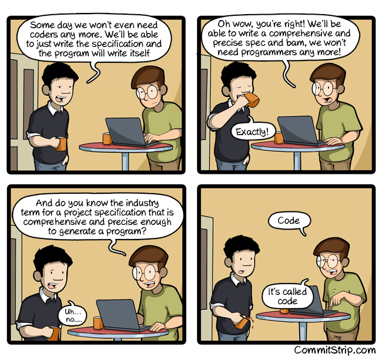
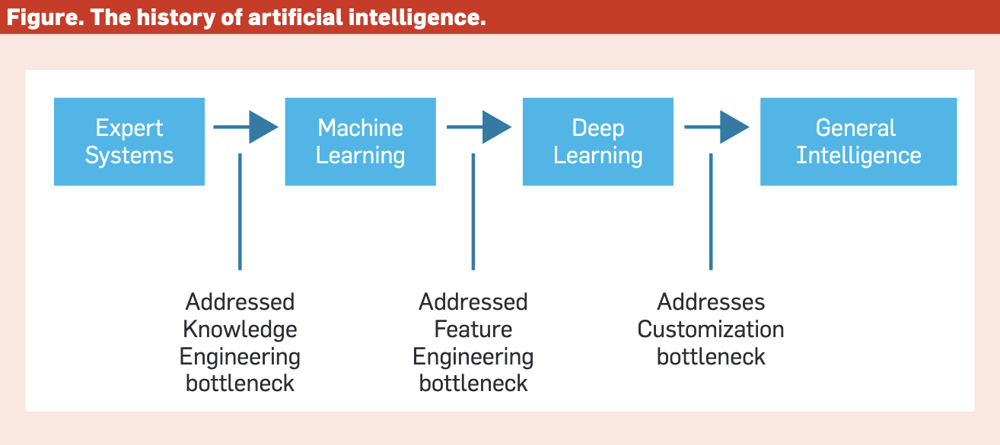
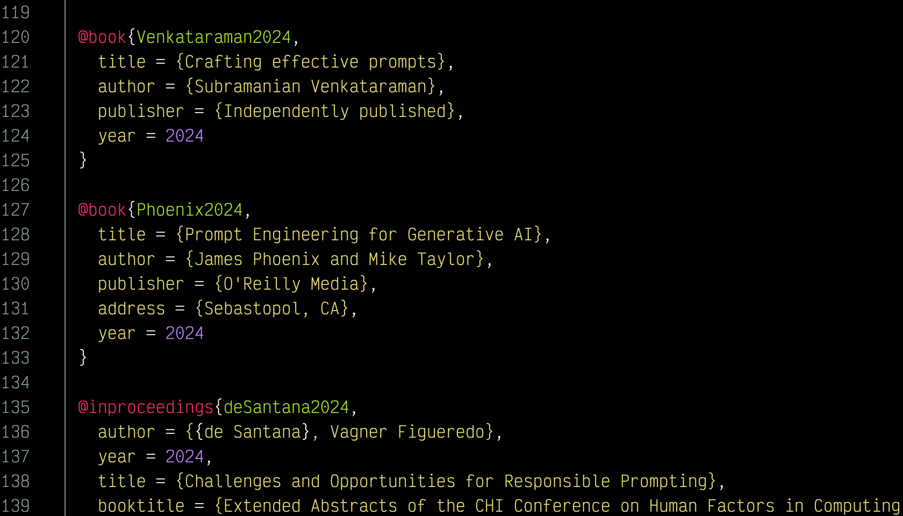
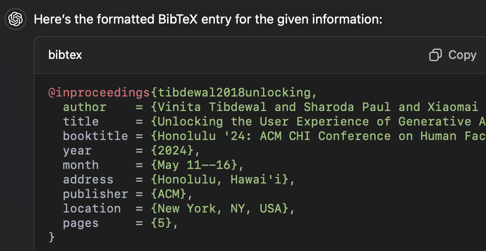

::: {style="position: fixed; font-size: 5em; color: gray;"}
Welcome!
:::

# Schedule for today
- 1530--1540 brief intro
- 1540--1600 reading `ai-2027.com` and `ai_report_2025.pdf`
- 1600--1610 forming teams: positive, negative, and alternative
- 1610--1645 debate: I'll call on you to represent the above three positions
- 1645--1700 break
  1700--1705 taking attendance
- 1705--1745 slideshow intro to course (rest of this slideshow)

# Setting the stage

## Let me set the stage for our adventure
::: {.incremental}
- This is all new, this course, this topic
- There are no models for how it should be run
- We're pioneering new ground
- Congratulations! You can call yourself a pioneer but you could also call yourself a guinea pig!
:::

## Pioneering is good and bad
::: {.incremental}
- You can probably guess the good aspects of being a pioneer, but what about the bad?
- We may have to change course often.
- We may go down blind alleys.
- We *will* face a lot of uncertainty.
- If this kind of thing bothers you, you should drop the course and wait until we have done all the pioneering work and you can follow.
- $\langle$ Pause to let the room clear $\rangle$
:::

## Constraint
::: {.incremental}
- There are no prereqs (except a bit of Python). You may not even know how to spell AI
- $\langle$ Pause for laughter $\rangle$
- $\langle$ If no laughter, tell mother-in-law joke $\rangle$
- Since there are no prereqs, we have to start before the beginning.
- I need to tell you a little bit of history, so you get the context.
:::

## Remainder of today
::: {.incremental}
- We'll review @Dhar2024 for a bit of history
- We'll learn how you'll do homework and presentations
- Finally, we'll introduce Exercise A.
- In fact, the general format of the class will usually be some lecture followed by some exercises.
- Next week, we'll discuss the general framework for the semester, but I want to give you something to think about first---one view of learning is that it is like hanging ornaments on an Xmas tree---you need the tree but you also need to appreciate the ornaments: which should come first?
:::

# Before we begin, TANSTAAFL

That stands for "There ain't no such thing as a free lunch"

Many people think AI will provide a free lunch. I don't.

::: {.notes}
This phrase and acronym were popularized by a science fiction writer (Robert A. Heinlein) nearly a century ago, when many people were optimistic about new technologies and their promise of improving our lives. It was prescient at that time to observe that these technologies come with a cost. As we approach generative AI, we need to remain vigilant about the costs, whether we stop to mention it or not.
:::

##

{fig-align="center"}

You will have to work (think) to make AI work (think) for you

::: {.notes}
This cartoon may become controversial soon. We are still in a situation where the computer does what we tell it to but the level at which we tell it what to do is becoming more and more abstract.
:::

$\langle$ Pause to let the room clear $\rangle$

# Exercise: What I already know
- There is a google doc referenced in Canvas (on the course's home page) that I want you to edit throughout the semester
- There is some starter text for you to add to
- Please also add your own sections but *please* use appropriate section headings and subheadings rather than jury-rigging text attributes as headings

::: {.notes}
One of my two main pet peeves is when students make a "heading" by simply continuing to type but changing the font to boldface. That prevents us from doing things like developing an automatic table of contents. Please don't do that in this class. (My other pet peeve is using the word "leverage" as a synonym for "use". Please use the word "use" instead of leveraging the word "leverage" in this class and expunge "leverage" from results of prompting---generative AI tools are quite fond of "leverage".)
:::

##

```{r, engine = 'tikz',echo=FALSE}
#| fig-align: center
 \begin{tikzpicture}
     % Draw the red circle with a slash
     \draw[red, line width=3mm] (0,0) circle (2cm);
     \draw[red, line width=3mm] (-1.4,-1.4) -- (1.4,1.4);

     % Add the word "LEVERAGE" behind the circle
     \node[opacity=0.5] at (0,0) {\Huge \textsf{LEVERAGE}};
 \end{tikzpicture}
```

# Paradigm shifts in AI

@Dhar2024 covers four periods in AI history and the paradigm shifts between them.



This isn't all of AI history but is a simplified picture that will help us understand the task we face in making AI work for us.

## Expert Systems
::: {.incremental}
- Work in well-circumscribed domains where expertise is identifiable and definable
- Perform well at specific tasks where expertise can be extracted from humans
- Represent problems as relationships between situations and outcomes
- Considered intelligent if performing like human experts
- Example: *high pallor* $\Rightarrow$ *excess bilirubin*
:::

## Machine Learning
::: {.incremental}
- Learn models from curated examples
- Driven by database technology, Internet, abundance of data
- Grew in parallel with neural networks
- Rely on loss functions measuring difference between predictions and empirical reality
- Influenced by philosopher Karl Popper
- Example: Predicting pneumonia from historical medical records of people with and without pneumonia
:::

## Deep Learning
::: {.incremental}
- Usually conducted via deep neural networks
- Takes raw input (images, language, sound) instead of human description
- Acts as a *universal function approximator*
- Learns features implicitly associated with raw input
- Example: Vision system sees lines, colors, curves and, through successive layers of neurons, combines them into doors, windows, street signs
:::

## General Intelligence
::: {.incremental}
- Pre-trained models integrate a large corpus of general and specialized models *not* optimized for a single task
- Language is a critical carrier of knowledge, powering large language models (LLMs)
- Pre-trained models learn through self-supervision on uncurated data, e.g., WWW
:::

## Paradigm Shifts
::: {.incremental}
- Draws on the work of philosopher Thomas Kuhn
- Perceives history of science as punctuated by upheavals displacing dominant paradigms
- Identifies bottlenecks that lead to paradigm shifts
:::

##


# Current Paradigm in Science

## AI as general-purpose technology

General-purpose technology, such as electricity or the Internet, is defined by economists as a new method for producing and inventing that is important enough to have a protracted aggregate economic impact across the economy

## Characteristics of General-Purpose Technologies
::: {.incremental}
- pervasiveness
- inherent potential for technical improvements
- innovational complementarities
:::

## Challenging characteristics of the current paradigm
::: {.incremental}
- opacity to humans, i.e., AI can't explain itself well (yet)
- explanation and transparency are important to humans
- legal questions of ownership and control of uncurated data, weights, and outputs
- nature of uncurated data as biased, rife with falsehood and noise
- AI is not designed to be truthful and is noisy and inconsistent
:::

## State of the world is a factor
::: {.incremental}
- Alignment problem: are our subgoals aligned with our goals?
- and are the goals and subgoals aligned with those of AI?
- Example: Goal *Save the planet* might cause the AI to infer subgoal *eliminate humans*
- Scalability simplifies the work of bad actors
:::

## Human nature
::: {.incremental}
- deepfake porn of hundreds of thousands of ordinary women was overlooked, but policy action was taken when a celebrity was the victim
- policy action is generally slow compared to technological advances
- policy action tends to favor the very rich and well-connected
- this has implications for all the legal and policy questions of AI
:::

# Conversation

## Collaboration
::: {.quotation}
All of us know more than any of us.
:::
::: {.attribution}
--- Robert O. Briggs
:::

::: {.quotation}
The intelligence of that creature known as a crowd is the square root of the number of people in it.
:::
::: {.attribution}
--- Terry Pratchett
:::

::: {.notes}
Bob Briggs, an obscure scholar, liked to preface the use of groupware (software for group work) by saying that "All of us know more than any of us". But famous author Terry Pratchett liked to remind us of the destructive power of certain groups of people.

Which view do you subscribe to? Perhaps both at different times and in different places? Sometimes collaboration helps us the most and sometimes solitary work serves us best. Which situation are we in today? Will we stay in this situation all semester long?
:::

## The Art of Conversation
::: {.incremental}
- If you search for books about the art of conversation, what will you find?
- The first book I found talked about conversation for pure pleasure
- The second book I found talked about body language during conversation
- Prompt engineering is essentially a conversation, but so different from what I think of as conversation
- We need to think of it as conversation, but study it separately from conversation that gives us enjoyment or happens face-to-face with another person
:::

::: {.notes}
I should add that body language is not a far-fetched concept in the conversation with generative AI. Certainly the camera in your laptop can detect your interest in the conversation, your mood, and more. And generative AI tools can certainly produce avatars that react to your body language.
:::

# Presentations

## Goal
You must each present (1) a success you've experienced with genAI and (2) a challenge that you have not yet overcome with genAI. That is the ten percent presentation grade in class. The Python exercise will determine the schedule of presentations.

- Please create the presentation using Quarto, which I will demonstrate.
- Please explain your success and your challenge (I will demonstrate in a minute)
- Please show your prompts (your dialog) leading to success and failure
- Please tell us how we can benefit from what you've learned

## Example---success
I use a format called BibTeX to construct bibliographies. Here's a fragment.



It's tedious to enter.

## My first prompt almost worked!
`Please format the following as a BibTeX inproceedings entry`

`Vinita Tibdewal, Sharoda Paul, Xiaomai Chen, Jennifer Kim, Obinna Anya, Mina Shojaeizadeh, and Ilteris Kaplan. 2018. Unlocking the
User Experience of Generative AI Applications: Design Patterns and Principles. In Honolulu ’24: ACM CHI Conference on Human Factors
in Computing Systems,May 11–16, 2024, Honolulu, Hawai’i. ACM, New York, NY, USA, 5 pages`

## Output of first prompt


## Adjustments
::: {.incremental}
- I have a key format I always use and `tibdewal12018unlocking` doesn't fit (but the AI could not have known that)
- The booktitle should begin CHI '24 (but the AI could probably not have known that)
- The address and location should be swapped (not sure if the AI should have been able to figure that out)
- Overall, I gave it an A and promptly used it for a long list of unformatted bibliographic items, which it handled similarly
:::

## Example---challenge
Animate this

##

```{r}
#| engine = 'tikz',
#| engine.opts=list(extra.preamble=c("\\usepackage{pgfplots,stix,pagecolor}","\\pgfplotsset{compat=1.18}")),
#| echo=FALSE
\begin{tikzpicture}
  \tikzset{
        every pin/.style={fill=yellow!50!white,rectangle,rounded corners=3pt,font=\tiny},
        small dot/.style={fill=black,circle,scale=0.3}
    }
\begin{axis}[
  no markers, domain=0.75:3.45, samples=200,
  axis lines=left, xlabel={}, ylabel=\phantom{y},
  every axis y label/.style={at=(current axis.above origin),anchor=south},
  every axis x label/.style={at=(current axis.right of origin),anchor=west},
  height=4cm, width=7cm,
  xtick=\empty, ytick=\empty,
  enlargelimits=false, clip=false, axis on top,
    extra x ticks={0,2,2.5},
    extra x tick labels={\scriptsize 0, \scriptsize $t_c$,\scriptsize $t_{\alpha,\nu}$}
  ]
  \addplot [fill=cyan!20, draw=none, domain=2:3.5]
  {9*(x^(0.5*4-1))*((1+4*x/3)^(-0.5*4-0.5*3))} \closedcycle node [style={font=\scriptsize},above,text width=1.5cm] at (axis cs:0,0.008) {};
   \node[small dot,pin=80:{$p$}]  at (axis cs:2.25,0.12) {};
  \addplot [fill=cyan!30, draw=none, domain=2.5:3.5]
  {9*(x^(0.5*4-1))*((1+4*x/3)^(-0.5*4-0.5*3))} \closedcycle node [style={font=\scriptsize},above,text width=1.5cm] at (axis cs:0,0.008) {};
   \node[small dot,pin=80:{$\alpha$}]  at (axis cs:2.8,0.09) {};
  \addplot [very thick,cyan!50!black] {9*(x^(0.5*4-1))*((1+4*x/3)^(-0.5*4-0.5*3))};
\end{axis}
\end{tikzpicture}
```

##
The preceding possibility shows the situation where
$t_{\alpha,\nu}>t_c$, which is equivalent to saying that
$p>\alpha$.

The $x$-axis scale begins to the left of the fragment shown here, and values of $t$
increase from left to right. At the same time, the
shaded regions decrease in size from left to right.
Note that the entire shaded region above is $p$,
while only the darker region at the right is $\alpha$.

::: {.notes}
Note that the math on this slide is in a different font than the remainder of the text. This appears to be a limitation of the slide-making software that has this particular math font hardcoded into it. I've written to the developer requesting a fix.
:::

## The challenge
I tried several times to get a genAI tool (can't remember if it was DALL-E or Midjourney or what) to animate this, only to experience repeated failures of many kinds. I thought of making this an exercise, in fact, because it seems like a difficult problem.

On the bright side, I have since learned that, instead of asking for a picture, I might be better off asking for a programmatic specification of a picture, allowing me to tweak the parameters. That's how I arrived at the preceding *no leverage* picture.

Unfortunately, it did not work in this case and the output is too involved to put on a slide. Instead, I will share my dialog with ChatGPT separately.

$\langle$ Pause to show dialog $\rangle$

## The outcome
I created eighteen LaTeX files and about fifteen Python scripts trying to debug this but could never get even a rough output I could work with. I tried debugging both the Python scripts and the LaTeX input with no success. The challenge remains $\cdots$

One additional problem is that I couldn't portray the issues in a presentation. I would need a video to go through the ChatGPT window. I'm reluctant to ask you to produce a video for your presentation but I will allow it if you prefer.

## Presentations in Quarto
You'll need to turn in a .qmd file and a .html file by 11:59PM the night before your presentation. Optionally, you may also turn in an .mp4 file. (If you do that, we can run the .mp4 file in class instead of having you present.)

How do you do that? Just open R Studio and select File > New File > Quarto Presentation. The system will create a small presentation template for you. Now we'll add to it.

## Why Quarto?
::: {.incremental}
- Quarto is a tool that helps you do *reproducible research*
- Quarto helps you document the steps you took
- Quarto encapsulates the code (in this case, Python code) and your commentary about what you did, including any pictures, equations, videos, or anything else that a word processor can include
- Quarto provides a text that is readable by any text editor of your preference
- Quarto documents and slideshows can be rendered to html or any of about a dozen other formats
:::

## How to use Quarto
::: {.incremental}
- Note that you don't have to follow these instructions if you already know how to use Quarto
- Be sure you have Python on your computer (how you do that is up to you; I use `pyenv`)
- Download R; then download R Studio (the order is important)
- Download the file `eA.qmd` from Canvas
- Open R studio; choose Open File from the menu; open `eA.qmd`
- `eA.qmd` is a template for exercise A
- Fill in your name
- Do the exercise in this file, documenting what you do as you go
- Intersperse code and commentary, including prompts you use
:::

## Problem?


$\langle$ Pause to demo Quarto Presentations $\rangle$

::: {.notes}
If you are on macOS, I encourage you to reduce your Python installations to no more than two, the one macOS installs (because it's hard to get rid of and may get reinstalled automatically upon an OS update), and the one you actually use. I use `pyenv` and I install that using `homebrew`. Then I install Python using `pyenv`, not using `homebrew`. The reason is that, if you actually need additional Python versions, `pyenv` manages them for you. I would get rid of miniconda, anaconda, and other automatic Python installations if I were you.

If you are on Windows, good luck. I don't know how it works. I switched to mac so I wouldn't have to deal with Windows.
:::

# Exercise A

## Write a short Python program
::: {.incremental}
- task: generate a random order for students to make presentations in this class
- constraint: everyone must present once
- constraint: no more than three may present on a given day
- constraint: no fewer than two may present on a given day
- constraint: there are twelve days on which students may present
- if no program works by the end of today's class, we will use the program I wrote and will show as a demo
:::

## Approaching this exercise
::: {.incremental}
- You can make this very simple by doing some manual labor
- You need to break the problem down into parts
- You need to iterate
- You need to document what you do
- As with all exercises, I ask you to turn in a Quarto qmd file and an html file (both are required for credit)
:::

---

::: {style="text-align: right; font-size: 300px; font-weight: bold;"}
END
:::

# References

::: {#refs}
:::

# Colophon

This slideshow was produced using `quarto`

Fonts are *Roboto Light*, *Roboto Bold*, and *JetBrains Mono Nerd Font*

