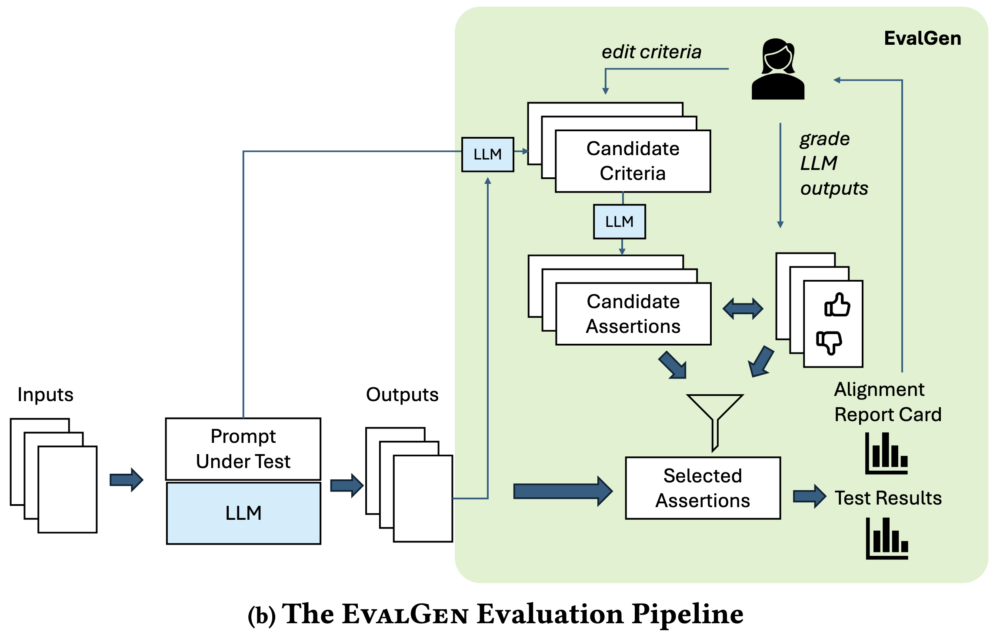
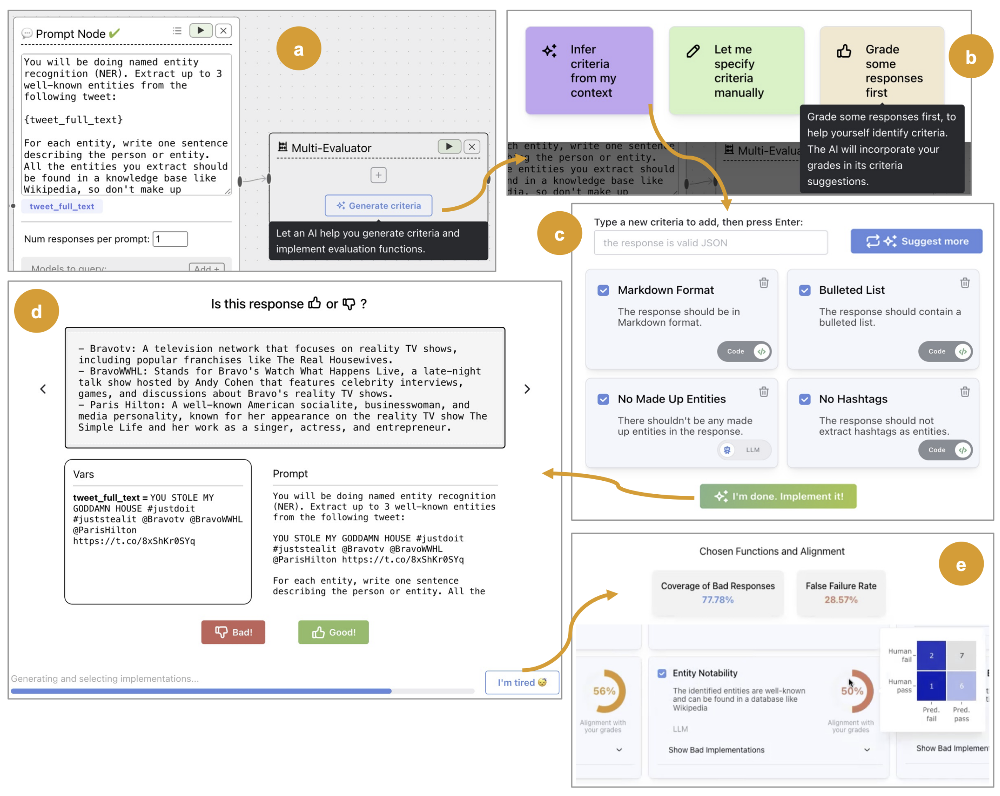

::: {style="position: fixed; font-size: 4em; color: gray;"}
Week Three
:::

# Agenda
- Finish group assignments
- Review syllabus
- Review whatiknow
- Review eA
- Evaluation of LLMs
- Announce eB

# eA

## Scoring
- Average score: 4.7/5 (95%)
- Grading was very lenient
- But the honeymoon is over
- Many people disregarded instructions like the file names---I'll take off points for these omissions in future assignments
- I don't regrade assignments---I make suggestions for improvement that you should implement so that the hw is useful to you in the future
- Why don't I regrade? Think about it!
- I don't regrade because everyone would eventually get a 5/5

## Observations
- One person did a single prompt
- One person did five prompts
- Most did two or three prompts
- Some people did not include an intro or conclusion
- Most people did not mention the exact model used

## Exemplary version
Let's pause to look at an exemplary version of the assignment. Notice the detailed commentary and conclusion.

## Requirements
- Notice that I gave you very few requirements
- I did not give you a list of detailed instructions to follow
- I will typically underspecify the assignment and let you be adventurous
- What happens if you just do the minimum?
- Can you be replaced by genAI?
- You have to be creative and adventurous to survive in the workplace

## Observations
- You must iterate
- You must be specific
- There will be drift (the model forgets what you told it earlier)
- Giving the model my instructions is not enough!
- You have to be creative and analyze the output
- Feedback helps
- You can control parameters
- The model has limitations to discover

## The best submissions
- Capitalized names
- Gave actual dates
- Arranged results in chronological order (alphabetical order as an addition would have been good)
- Formatted results in markdown format (but could have incorporated markdown output into the body of the document)

# News

## Deepseek R1
- Deepseek is a Chinese startup founded by Liang Wenfeng
- They rocked the US stock markets this week by releasing a new LLM called R1
- R1 is claimed to be competitive with gpt-4o o3 but at a fraction of the cost to develop
- They are open source code, weights, and data
- They are offering R1 free to use, including for local installation
- My former student is running it on his Macbook and wants to try it on some version of Raspberry Pi
- Why should this matter to stock prices? $\langle$ Discuss $\rangle$

# Evaluation of LLMs
Another way to discover genuine principles is to evaluate LLMs. What qualities are we looking for in an LLM?

## Generic Qualities
- Fluency
- Relevance
- Coherence
- Perplexity (how well a probability model predicts a sample)
- Overlap of n-grams in translations (automating human judgments)
- Benchmark task performance (e.g., resolving ambiguous pronouns, demonstrating reading comprehension)

# @vanSchaik2024
Automating evaluation of LLMs

## Desiderata
- Scalable
- Automatic
- Reliable (LLMs are not reliable for evaluating LLMs)
- Cost-effective
- Considers new issues such as hallucinations

## Issues
- Hallucinations
- Knowledge recency
- Reasoning inconsistency
- Difficulty in computational reasoning

## Different communities evaluate different criteria
- Security and Responsible AI
- Computing performance
- Retrieval vs Gnerator Evaluation
- Offline vs Online Evaluation
- System Evaluation vs Model Evaluation

## Focus
van Schaik focuses on automatic, offline, system-level evaluation of generative AI text: methods for evaluating quality of summaries

## Qualities van Schaik addresses
- Fluency
- Coherence
- Relevance
- Factual consistency
- Fairness
- Similarity to reference text

## Three kinds of metrics
- Reference-based
- Reference-free (Context-based)
- LLM-based

## Reference-based metrics
- N-gram based metrics
- Embedding-based metrics
- Both are simple, fast, inexpensive
- Poor correlation with human judgments
- Lack of interpretability
- Inherent bias
- Poor adaptability
- Inability to capture subtle nuances

## Reference-free metrics (Context-based)
- Evaluation is a score
- Quality-based metrics
  - Based on context or source
- Entailment-based metrics
  - Based on the Natural Language Inference (NLI) task
  - Determines whether output entails, contradicts, or undermines premise
- Factuality, QA, and QG-based metrics
  - Based on the QA (question answering) and QG (question generation) tasks
  - Determines whether output is factually correct

## Limitations of reference-free metrics
- Bias towards underlying model outputs
- Bias against higher-quality text
- But improved correlation with human judgments!

## LLM-based metrics
- Prompt-based evaluators
- LLM embedding-base metrics
- These are new and not well-studied
- They are probably expensive to study (modulo DeepSeek)

## Best practices
- Use a suite rather than relying on a single metric
- Use standard (e.g., factual consistency) and custom (e.g., writing style) metrics
- Example: measuring F1 score overlap between regex extraction and ground truth on electronic product summaries
- Use LLM and non-LLM metrics
- Validate the evaluators (usually against human judgments)
- Visualize and analyze metrics (e.g., use boxplots)
- Involve experts to annotate data, evaluate summaries, and design metrics

## More best practices
- Data-driven prompt engineering
- Tracking metrics over time
- Appropriate metric interpretation

## Open challenges
- Cold start problem
  - Synthesize data (but may not represent distributions)
  - Repurpose existing data (e.g., search engine logs)
- Subjectivity in evaluating and annotating text
  - Empirical IRR results show medium (80%) inter-rater reliability
- Challenge of good vs excellent
  - Difficult to discern between good and excellent

## Additional Observations
- Lead author got PhD from Imperial College London, ranked 2 worldwide by QS
- Paper is published in SIGIR, a top conference in information retrieval
- Some material is already out of date given OpenAI o3 and DeepSeek R1

# @Shankar2024
LLMs are the new way to evaluate LLMs!

What could possibly go wrong?

Shankar presents an example solution to the obvious problem

## Alignment with human judgments
This is the most frequent goal of automatic evaluation

## Criteria Drift
Users need criteria to grade outputs but grading outputs helps users define criteria

Some criteria cannnot be defined *a priori*

## Problems with LLMs
- They hallucinate
- They ignore instructions
- They generate invalid outputs
- They generate uncalibrated outputs

## Existing tools
- Many tools exist for prompt engineering and auditing
- These tools require metrics
- These tools usually include calls to evaluator LLMs
- Evaluator LLMs evaluate things like conciseness that are hard to encode
- Evaluator LLMs struggle to find alignment with human judgments
- Hard to craft code-based assertions, such as appropriate regexes
- Hard to craft prompts due to unintuitive sensitivities to minor wording changes

## Addressing challenges
- Reduce user effort
- LLM suggests a criterion in natural language in context
- User modifies criterion
- LLM generates pool of candidate assertions for each criterion
- User votes *good* or *bad* (for each criterion or assertion or both?)
- Embed solution in ChainForge (a prompt engineering tool created by the last co-author)

::: {.notes}
Prominent prompt engineering tools we'll look at later include

OpenAI Playground,
AI21 Studio,
Cohere,
PromptPerfect,
TextSynth,
PromptHero,
Replika,
HuggingFace Transformers
:::

## Aside on ChainForge, which claims you can:

- test robustness to prompt injection attacks
- test consistency of output when instructing the LLM to respond only in a certain format (e.g., only code)
- send off a ton of parametrized prompts, cache them and export them to an Excel file, without having to write a line of code
- verify quality of responses for the same model, but at different settings
- measure the impact of different system messages on ChatGPT output
- run example evaluations generated from OpenAI evals
- ...and more

## User study
- Nine users---industry practitioners
- Qualitative criteria
- Generic task
- Little guidance provided to participants

## Background
- Prompt engineering is a new practice and research area
- Auditing practices like red-teaming are used to identify harmful outputs
- LLM operations or LLMOps include new tools and terminology: prompt template, chain of thought, agents, and chains
- LLM-based evaluators are also called LLM-as-a-judge or co-auditors
- Prompt engineering tools allow users to write evaluation metrics but don't provide mechanisms like EvalGen (their tool) to align LLM evaluators with expectations
- PE tools at most allow you to manually check outputs

## Over-trust and over-generalization
- Prior research shows people trust LLMs too much and generalize too much from them
- Example: MIT EECS exam where gpt-4 graded itself with an A but didn't deserve it
- Set ordering matters in asking an LLM to choose from a set!
- LLMs are overly sensitive to formatting changes
- Users tend to throw out entire chains from one unsuccessful prompt
- Users tend to over-generalize from first few outputs
- Users tend to over-generalize from small numbers of error reports

## Aligning LLMs with user expectations
- Interactive systems have been shown to better match user expectations
- Interactive systems typically assist users in selecting training examples, labeling (annotating) data, and evaluating results
- All LLM alignment strategies feature human-in-the-loop
- Heritage is pre-defined benchmarks from NLP and ML

## Summary of background
- Help is needed both in prototyping evaluations and validating LLM evaluators
- Human evaluators are prone to over-reliance and over-generalization
- These both lead to the authors' proposed solution, EvalGen

## EvalGen pipeline

::: {.notes}
The green area is what EvalGen covers. The inputs and outputs outside the green area are the province of ChainForge, which may be handling multiple LLMs. Note that the human in the loop is grading assertions and editing criteria.
:::

## EvalGen workflow

::: {.notes}
This picture is apparently not complete but shows (a) the prompt node and multi-evaluator node; (b) the pop-up EvalGen wizard with three options, Infer, Manual, and Grade First; (c) the Pick Criteria screen, allowing users to describe criteria in natural language and toggle Code or LLM implementations; (d) the Grade screen, featuring the LLM output, input variables, and prompt, as well as Good and Bad buttons and an I'm tired button; and finally (e) the Report Card screen, showing the alignment of each criteria and across criteria. Hovering over alignment shows a confusion matrix.
:::

## System implementation
This section is mainly of interest to system builders, a small subset of the audience here and not within course scope. I'll only discuss it if people have questions.

## Algorithm evaluation
- Evaluated against SPADE as a baseline (is that valid?)
- Uses a medical prompt (extract info from doctor-patient without revealing PII) and a product pipeline (craft SEO-friendly descriptions for Amazon products)
- Note that product pipeline includes negative reviews, which must be filtered out of the description
- Note that they used gpt-3.5 turbo (published May 2024)
- Manually graded all 184 outputs
- Issues included PII in the medical task and negative reviews or lengthy content in the product task

## Two big differences between EvalGen and SPADE
- EvalGen solicits input from the user about criteria and SPADE does not
- EvalGen picks the most aligned assertion per criterion that meets some false failure rate threshold, while SPADE solves an optimization problem to select a minimal assertion set that meet a false failure rate threshold and cover all SPADE-generated criteria

## Algorithm evaluation results
- EvalGen is more aligned with user expectations than SPADE due to the user input
- EvalGen requires fewer assertions than SPADE
- SPADE produced unrealistic assertions like *flag the words "never order"* and *flag the word "disappointed"*

## User Study Participants
- Nine users---industry practitioners as mentioned above
- Included software engineers, ML scientists, startup executives, and independent consultants
- Invoked "five is enough" excuse
- Focused on LLM-experienced developers
- Introduced system using a named entity recognition task (100 tweets)
- Gave participants 40 minutes of think-aloud time to explore the tool
- Used common qualitative techniques to analyze data (open and axial coding)

## General findings
- Participants liked having control
- Participants encountered difficulties in aligning assertions with preferences because of two reasons
  - some criteria are hard for humans to evaluate
  - criteria drift (loop of output and refined criteria)
- Code-based and LLM-based evaluators affected alignment and needs

## Typical workflow
- eyeballing LLM outputs
- Starting EvalGen
- Grading outputs
- Refining criteria
- Grading more outputs
- Understanding alignment on graded outputs
- Eyeballing alignment on ungraded outputs

## Criteria drift
- Criteria drift $=$ Grading outputs spurred changes in criteria
- Participants wanted to add new criteria during the process, which EvalGen does not allow (you have to start a new process)
- Participants reinterpret existing criteria to better fit LLM behavior
- E.g., participants changed criteria from named entities must all be proper nouns to named entities must mostly be proper nouns
- One participant kept grading the same way for consistency but didn't feel it reflecting changing opinion
- Two participants changed their views about hashtags during the process

## Grading approach depends on difficulty of evaluating a criterion
- Participants wanted to set different false failure rates depending on difficulty of evaluating a criterion
- Some participants couldn't trust their grades because they couldn't evaluate as well as the machine
- Example: word count is hard for humans but easy for machines

## Alignment is subjective
- Especially in converting natural language criteria to code-based assertions
- For code-based assertions, EvalGen never matched participant expectations of criterion interpretation (here they say gpt-4 instead of gpt-3.5 turbo)
- Grades therefore had no impact
- Example: two participants had different interpretations of the hashtag criteria, so one was satisfied and the other was not
- Some disagreement existed between participants regarding the resolution of the named entitity, e.g., Nike vs Nike Shoes

## Code vs LLM evaluators
- Users preferred code-based evaluators for formatting checks, count-based checks, and specific phrase inclusion / exclusion
- Users preferred LLM-based evaluators for "fuzzy" criteria or when external knowledge was required
- For code-based, they wanted to see the code
- For LLM-based, they were less trusting

## More on criteria drift
- Paper strongly suggests that criteria drift is a problem needing interaction between user and system
- Paper asserts no evidence that criteria "settle down" after a while
- Paper raises epistemic questions about whether alignment is completely attainable
- Paper places high value on subjectivity of human judges as not irrational
- Paper raises the question of whether validating the validators can ever be truly finished

## Future work and limitations
- Authors suggest evaluators move beyond binary judgments
- Authors admit to limited pipelines, limited sample of humans, and short time frame
- Authors opine that users want automatic improvement in prompts based on assertion results
- Authors suggest a regime where prompts, assertions, and evaluative mechanisms are all continuously refined in a unified interface

## Additional observations
- UIST is a prominent conference in human-computer interaction, but not as prominent as CHI or CSCW; not on par with SIGIR's status in the IR world; yet it has a similar acceptance rate of 20 to 25 percent
- Paper is not heavily edited or particularly well-written, so probably succeeded on importance of late-breaking results

# eB

## Specification
- Assemble a bibliography in BibTeX format
- The subject is PDF remediation
- PDF remediation is the process of making a PDF accessible to people with disabilities
- Most of the literature is about research papers students are required to read
- I'm familiar with this literature, making it easier for me to detect hallucinations
- I can also judge the importance of the papers listed
- A recent bibliography in this area listed 39 sources, of which only about 20 were relevant
- Document your process!

---

::: {style="text-align: right; font-size: 300px; font-weight: bold;"}
END
:::

# References

::: {#refs}
:::

# Colophon

This slideshow was produced using `quarto`

Fonts are *Roboto Light*, *Roboto Bold*, and *JetBrains Mono Nerd Font*

