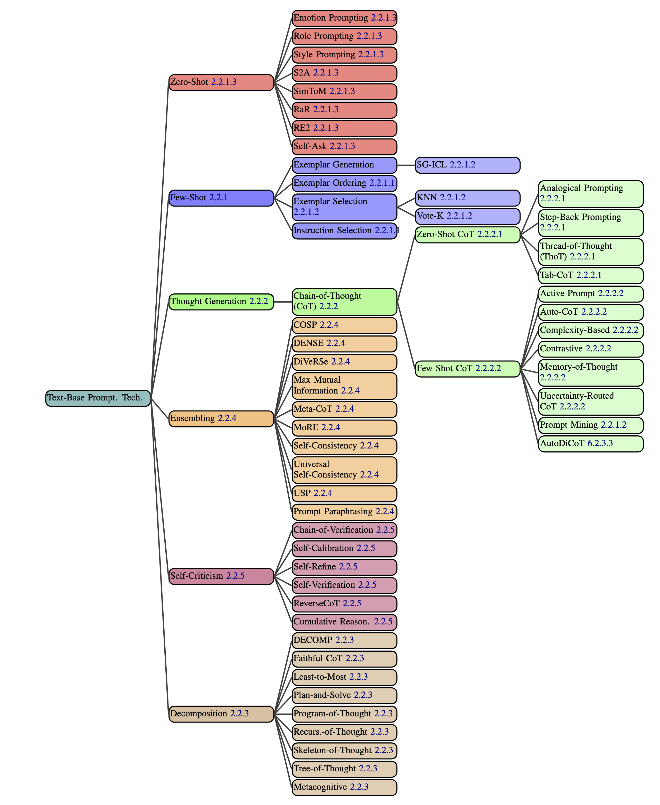

::: {style="position: fixed; font-size: 4em; color: gray;"}
Week Five
:::

# Agenda
- Presentations: Vanshita, Jaykumar
- News
- Review whatialreadyknow (Ishwari)
- eB review
- eC preview
- m1 questions
- Agenta (again)
- Potato (again)
- Techniques
- Frameworks
- Work time

# Presentations

# News

## s1
- From `simplescaling`
- Trained on 1,000 examples
- Each example is $\langle$ a question $\rangle$ $\langle$ an answer $\rangle$ $\langle$ a reasoning process $\rangle$
- First tried 59,000 examples
- [article at Economist](https://www.economist.com/science-and-technology/2025/02/12/forget-deepseek-large-language-models-are-getting-cheaper-still)

## The Batch

$\langle$ pause to look at this week's edition $\rangle$

# WhatIAlreadyKnow (Ishwari)

# eB review

## Smart strategies
- adjust the temperature (needs API)
- adjust the max_tokens (needs API)
- do it piecemeal
- use more than one LLM
- think about the goal more than constraints

# eC preview

$\langle$ look at the doc $\rangle$

# m1 questions

## Deliverable
- A short qmd / html document describing the domain
- The doc should include specification of whether you plan to run locally or using a cloud service
- The doc should include a discussion of the possible datasets you might use (the actual dataset will be due in m2)
- You are not required to stick with the directions you give here, but this should be your current best guess of what you plan to do
- Examples: chatbot to emulate a foreign leader; chatbot to triage banking problems; chatbot to analyze tweets

## My message

$\langle$ look at the message $\rangle$

# Agenta (again)

# Potato (again)

```bash
mkdir labeling && cd labeling
git clone https://github.com/davidjurgens/potato.git
cd potato
pip install -r requirements.txt
python potato/flask_server.py start project-hub/simple-examples/configs/simple-check-box.yaml -p 8000
```

This will allow you to login. Then you can go to `http://localhost:8000` and login. Then try the following while you're still logged in:

```bash
python potato/flask_server.py start project-hub/politeness_rating/configs/politeness.yaml -p 8000
```

# Techniques

## According to @Schulhoff2024


## Important Note
There is no substitute for reading @Schulhoff2024! I'm just listing the main concepts here. I'll ask you to pick one and explain it in your own words.

## Top level
- Zero-Shot
- Few-Shot
- Thought Generation
- Ensembling
- Self-Criticism
- Decomposition

## Few-Shot Design Decisions
- Exemplar Quantity: as many as possible
- Exemplar Ordering: randomly order them
- Exemplar Label Distribution: balance the distribution
- Exemplar Label Quality: ensure correct labeling
- Exemplar Format: use a common format
- Exemplar Similarity: select similar examples to the test instance

## Few-Shot Techniques
- *difficult to implement*
- K-Nearest Neighbors
- Vote-K
- Self-Generated In-Context Learning
- Prompt Mining
- Complicated Techniques use iterative filtering, embedding and retrieval, and reinforcement learning

## Zero-Shot Techniques
- *use no exemplars*
- Role Prompting
- Style Prompting
- Emotion Prompting
- System 2 Attention
- SimToM
- Rephrase and Respond
- Re-reading
- Self-Ask

## Thought Generation
- *prompting the model to articulate its ongoing reasoning*
- Chain-of-Thought
- Zero-Shot Chain-of-Thought
- Step-Back Prompting
- Analogical Prompting
- Thread-of-Thought Prompting
- Tabular Chain-of-Thought

## Few-Shot CoT
- *multiple examples, including chains-of-thought*
- Contrastive CoT Prompting
- Uncertainty-Routed CoT Prompting
- Complexity-based Prompting
- Active Prompting
- Memory-of-Thought Prompting
- Automatic Chain-of-Thought Prompting

## Decomposition
- *explicitly decomposing the problem into subproblems*
- Least-to-Most Prompting
- Plan-and-Solve Prompting
- Tree-of-Thought Prompting
- Recursion-of-Thought Prompting
- Program-of-Thoughts
- Faithful Chain-of-Thought
- Skeleton-of-Thought
- Metacognitive Prompting

## Ensembling
- *using multiple prompts to solve the same problem, then aggregating the results, for example, by majority vote*
- Demonstration Ensembling
- Mixture of Reasoning Experts
- Max Mutual Information Method
- Self-Consistency
- Universal Self-Consistency
- Meta-Reasoning over Multiple CoTs
- DiVeRSe
- Consistency-based Self-Adaptive Prompting
- Universal Self-Adaptive Prompting
- Prompt Paraphrasing

## Self-Criticism
- *prompting the model to critique its own output*
- Self-Calibration
- Self-Refine
- Reversing Chain-of-Thought
- Self-Verification
- Chain-of-Verification
- Cumulative Reasoning

## Haystack

$\langle$ work through the tutorial $\rangle$

# 

::: {style="text-align: right; font-size: 300px; font-weight: bold;"}
END
:::

# References

::: {#refs}
:::

# Colophon

This slideshow was produced using `quarto`

Fonts are *Roboto Light*, *Roboto Bold*, and *JetBrains Mono Nerd Font*

