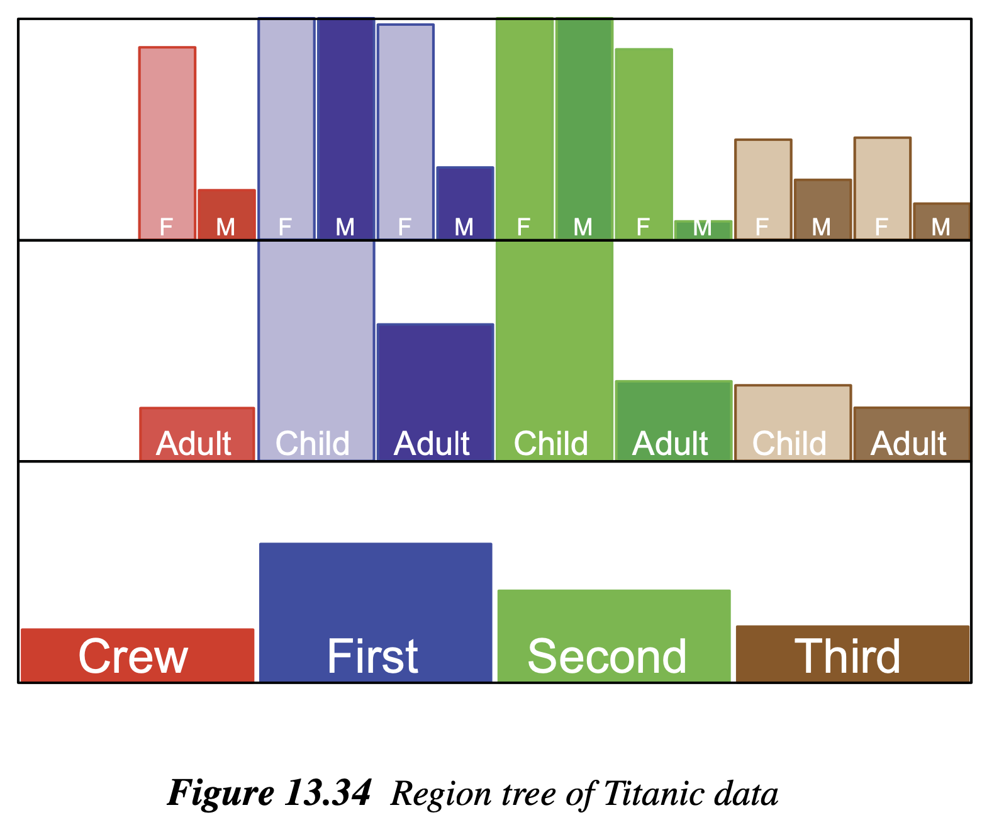
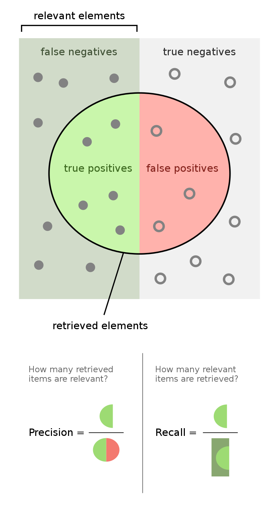

# [Week FIVE]{.r-fit-text}

# Agenda
- Presentation: Sanjai
- News
- Review whatiknow (Dhruvi)
- eB review
- eC preview
- m1 questions
- Finish previous chatbot
- Introduce Google AI Studio
- Techniques

# Presentation

# News

## OpenClaw
- Avoid at all costs
- It's a security nightmare
- Check out the commentary on [OpenClaw is changing my life](https://news.ycombinator.com/item?id=46931805)
- Or read about how [Moltbook was AI theater](https://news.ycombinator.com/item?id=46932911) from MIT Technology Review
- By the way [LLMs commit ethics violations](https://news.ycombinator.com/item?id=46954920)
- And the above comment section compares the three main frontier models

## The Batch and Data Points

$\langle$ pause to look at last week's edition $\rangle$

# WhatIKnow (Dhruvi)

$\langle$ pause to discuss contributions $\rangle$

## Writing and formatting the doc
1. Write about topics that excite you. If it greatly interests you, it's more likely to greatly interest others in the class.
2. Remember to date your contributions.
3. Use headings and subheadings in your contribution.
4. Use links in your contribution. Use Links from the Insert menu.
5. What else? How can we get the most out of this, both as readers and writers?

# eB review

## Smart strategies
- adjust the temperature (needs API)
- adjust the max_tokens (needs API)
- do it piecemeal
- use more than one LLM
- think about the goal more than constraints

# eC preview

$\langle$ look at the doc $\rangle$

# m1 questions

## Project levels
There are two groups of students in the class: novices (you've just met the requirement of one Python course), and advanced (you have significant development experience)

It is vital that the course meets the needs of both groups, which is not easy.

To achieve this, one necessity is to have varying levels of projects. Broadly there are two levels, novice and advanced. Both are eligible for an A grade. You should work comfortably at your limit, not shirking but not trying to be heroic.

You should deploy something you can put in your portfolio and can be anything from a simple chatbot like we created using `chatlas` or an agentic app using, say, Google's ADK. Include extensive use of prompting and make it possible to evaluate and compare prompts.

## Deliverable
- A short qmd / html document describing the domain
- The doc should include specification of model(s)
- The doc should include a discussion of the possible tools and or datasets you may use (actual tools and or datasets are due in m2)
- You are not required to stick with the directions you give here, but this should be your current best guess of what you plan to do
- Examples: chatbot to emulate a foreign leader; chatbot to triage banking problems; chatbot to analyze tweets; note that you can do other genAI tasks that require prompt engineering, such as image generation, as long as a conversation is involved
- Note that I'm expecting to see two levels of projects: novice (you've just met the requirement of one Python course), or advanced (you have signficant development experience)

# Simple chatbot revisited 
We'll create a chatbot about the famous Titanic dataset 

```bash
pip install shiny
shiny create --template querychat --github posit-dev/py-shiny-templates/gen-ai
```

## Notes 
The requirements.txt file contains some spurious code. Delete part about the python-package.

The `app.py` file is missing the `load_env()` code. Add it after line 5.

```python
from dotenv import load_dotenv
load_dotenv()
```

Otherwise, follow the onscreen instructions.

##



::: {.notes}
This picture is from @Wilkinson2005, Chapter 13. Note that it only shows proportions and doesn't tell us, for example, that there were more third-class passengers overall than there were first-class passengers.
:::

# Google AI Studio Intro
We'll start by doing the same thing in this environment that we did with `chatlas`, create a chatbot that offers expense policy advice.

<!--- 

# Potato (again)

```bash
mkdir labeling && cd labeling
git clone https://github.com/davidjurgens/potato.git
cd potato
pip install -r requirements.txt
python potato/flask_server.py start project-hub/simple-examples/configs/simple-check-box.yaml -p 8000
```

This will allow you to login. Then you can go to `http://localhost:8000` and login. Then try the following while you're still logged in:

```bash
python potato/flask_server.py start project-hub/politeness_rating/configs/politeness.yaml -p 8000
```

-->

# Techniques

## According to @Schulhoff2024


## Important Note
There is no substitute for reading @Schulhoff2024! I'm just listing the main concepts here. I'll ask you to pick one and explain it in your own words.

## Top level
- Zero-Shot
- Few-Shot
- Thought Generation
- Ensembling
- Self-Criticism
- Decomposition

## Few-Shot Design Decisions
- Exemplar Quantity: as many as possible
- Exemplar Ordering: randomly order them
- Exemplar Label Distribution: balance the distribution
- Exemplar Label Quality: ensure correct labeling
- Exemplar Format: use a common format
- Exemplar Similarity: select similar examples to the test instance

## Few-Shot Techniques
- *difficult to implement*
- K-Nearest Neighbors
- Vote-K
- Self-Generated In-Context Learning
- Prompt Mining
- Complicated Techniques use iterative filtering, embedding and retrieval, and reinforcement learning

## Zero-Shot Techniques
- *use no exemplars*
- Role Prompting
- Style Prompting
- Emotion Prompting
- System 2 Attention
- SimToM
- Rephrase and Respond
- Re-reading
- Self-Ask

## Thought Generation
- *prompting the model to articulate its ongoing reasoning*
- Chain-of-Thought
- Zero-Shot Chain-of-Thought
- Step-Back Prompting
- Analogical Prompting
- Thread-of-Thought Prompting
- Tabular Chain-of-Thought

## Few-Shot CoT
- *multiple examples, including chains-of-thought*
- Contrastive CoT Prompting
- Uncertainty-Routed CoT Prompting
- Complexity-based Prompting
- Active Prompting
- Memory-of-Thought Prompting
- Automatic Chain-of-Thought Prompting

## Decomposition
- *explicitly decomposing the problem into subproblems*
- Least-to-Most Prompting
- Plan-and-Solve Prompting
- Tree-of-Thought Prompting
- Recursion-of-Thought Prompting
- Program-of-Thoughts
- Faithful Chain-of-Thought
- Skeleton-of-Thought
- Metacognitive Prompting

## Ensembling
- *using multiple prompts to solve the same problem, then aggregating the results, for example, by majority vote*
- Demonstration Ensembling
- Mixture of Reasoning Experts
- Max Mutual Information Method
- Self-Consistency
- Universal Self-Consistency
- Meta-Reasoning over Multiple CoTs
- DiVeRSe
- Consistency-based Self-Adaptive Prompting
- Universal Self-Adaptive Prompting
- Prompt Paraphrasing

## Self-Criticism
- *prompting the model to critique its own output*
- Self-Calibration
- Self-Refine
- Reversing Chain-of-Thought
- Self-Verification
- Chain-of-Verification
- Cumulative Reasoning

# Exercise
Run the two readings, @Sahoo2024 and @Schulhoff2024, through NotebookLM. Ask it to summarize them and then ask about the discrepancy between the F1 scores in Schulhoff's case study. (Manual had high precision and low recall, while automated had the reverse.)

Then consider the diagram on the following screen, showing graphically the definitions of precision and recall (F1 is the harmonic mean of these two statistics). Comment on your view of how NotebookLM has described the difference between the F1 scores.

##

{fig-align="center"}

# 

::: {style="text-align: right; font-size: 300px; font-weight: bold;"}
END
:::

# References

::: {#refs}
:::

# Colophon

This slideshow was produced using `quarto`

Fonts are *Roboto Light*, *Roboto Bold*, and *Victor Mono Nerd Font*

