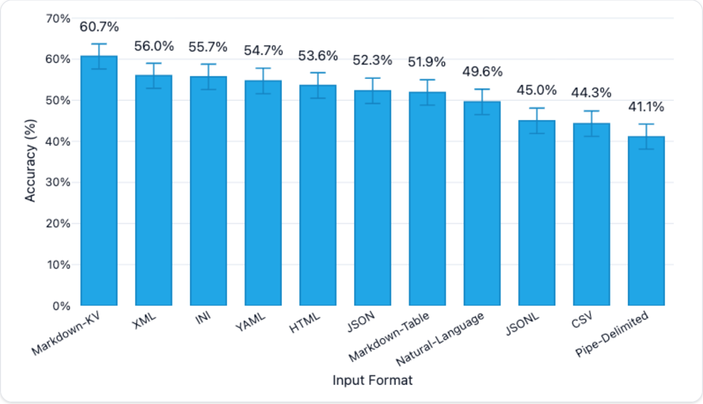

# [Week SEVEN]{.r-fit-text}

# Agenda
- Presentations: Prathyusha, Bruno
- News
- Review whatiknow
- Review eC, M1
- Recent work

# Presentations

# News

## Measurement!
[https://news.ycombinator.com/item?id=45458455](https://news.ycombinator.com/item?id=45458455)
is a discussion of an evaluation of table-reading by LLMs. (The referenced evaluation is blocked by UT Austin, by the way.)

This is old news, but one aspect of it, the Inspect framework, remains relevant.

## Results

## Discussion
- The evaluation prompted several others to build their own (better, in my opinion) evaluations!
- The top one found that model and number of rows in the table mattered more than the table format
- The [top one](https://github.com/jcheng5/table-formats?tab=readme-ov-file) used the [inspect framework](https://inspect.aisi.org.uk/llms.txt) to evaluate
- The Inspect framework is an invention of the UK government to evaluate LLMs
- Let's try out Inspect! (do the tutorial)

## Anthropic
- Anthropic vs the DoD
- Anthropic + Figma
- Anthropic relaxing ethics constraints

## The Batch

$\langle$ pause to look at this week's edition $\rangle$

## Simon Willison
- Claude Remote Control
- Vibe coding the Present.app presentation tool
- Agentic Engineering Patterns

# WhatIKnow
I'd like people to narrate their own contributions.

# eC review

## Some observations
- Excellent work overall! (average 4.36)
- Some great reflections in the conclusion
- Not everyone included cost or latency information
- Many people noted that the small sample was a problem
- Some people noted problems with Agenta.ai (which I also experienced!)

# M1 review
I'd like to share an exemplary report, but all were very promising (avg 10/10)

# Recent work
Last week, we learned that many prompting techniques promulgated in the past two years are already obsolete due to improved models. We can see from that experience that we need to attend to more recent work. Following is a selection of papers published in the past two days (!) that you can analyze. Break into pairs to discuss one of these papers and report back to the class after 45 minutes about what they portend.

## How to read---part one
Do not attempt to read the papers in a linear manner.

- First, read the abstract. Make a note about what you think the paper covers just from reading the abstract.
- Then look at the figures and figure captions.
- Next, look at the related work to understand the context.
- Then, skim the paper to get a sense of its contribution.
- Make notes on the terms to be defined.

## How to read---part two
- Use an LLM to generate a summary and compare that with what you have found out so far.
- Go back over the paper from front to back to pick up missed details.
- Provide your own summary, distinct from that of the LLM's. Present that to the class, along with a brief analysis of the LLM's summary and its differences from yours.

## The papers
- 2602.19458v1.pdf COMPLLLM: Fine-tuning LLMs to Discover Complementary Signals for Decision-making
- 2602.19718v1.pdf Carbon Aware Governance Gates: An architecture for sustainable genAI development
- 2602.19810v1.pdf OpenClaw, Moltbook, and ClawdLab: From Agent-Only Social Networks to Autonomous Scientific Research
- 2602.20021v1.pdf Agents of Chaos
- 2602.20332v1.pdf No one size fits all: querybandits for llm hallucination mitigation
- 26.20547v1.pdf What Drives Students’ Use of AI Chatbots? Technology Acceptance in Conversational AI

# [END]{.r-fit-text}

# References

::: {#refs}
:::

# Colophon

This slideshow was produced using `quarto`

Fonts are *Roboto* and *Roboto Light*

