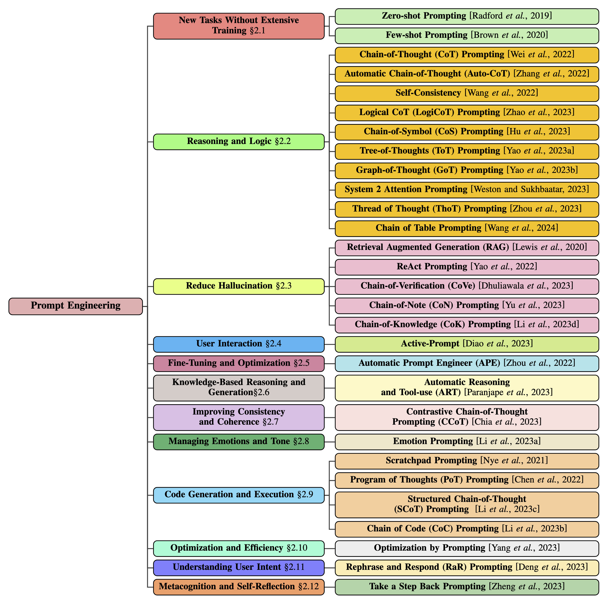

# [Week EIGHT]{.r-fit-text}

# Agenda
- Presentation: Akhil
- News
- Review whatiknow (everyone)
- eD demo
- m2 questions
- Inspect
- Approaches
- System prompts
- Work time

# Presentation

# News

## The Batch

$\langle$ pause to look at this week's edition $\rangle$

# WhatIKnow (everyone)
- remember, science is in the heart as well as the mind
- you must say things that matter to you

# Inspect

## Intro
- An evaluation framework for LLMs
- Needed because no one LLM dominates on every task
- Main components are datasets, solvers, scorers, tools, and agents
- Needs to be installed on your system, e.g., using `uv` or `pip`
- Uses Python scripts to orchestrate the evaluations
- The system is extremely flexible but has simple defaults

## Components
- Tasks are recipes for evaluations and contain at least a dataset, a solver, and a scorer, but optionally other things
- Datasets are usually just csv tables with an *input* and a *target* column, but can also be json or jsonl files or hugging face datasets or custom datasets
- Solvers are the heart of evaluations and can be as simple as single model calls or composite or component structures
- Scorers evaluate whether a task was successfully completed and can use the same model or a different model or an algorithm or other rubrics

## Simple Example

```python
from inspect_ai import Task, task
from inspect_ai.dataset import example_dataset
from inspect_ai.scorer import model_graded_fact
from inspect_ai.solver import (               
  chain_of_thought, generate, self_critique   
)                                             

@task
def theory_of_mind():
    return Task(
        dataset=example_dataset("theory_of_mind"),
        solver=[
          chain_of_thought(),
          generate(),
          self_critique()
        ],
        scorer=model_graded_fact()
    )
```

## Preceding Example
- It was a Python script
- It imported task, dataset, scorer, solver
- Assuming we have an api key, we can run it as follows

```bash
inspect eval theory.py --model openai/gpt-4
```

## Results
- The evaluation automatically creates a `logs` subdirectory
- We can say `inspect view` to access the material in that subdirectory (don't change to the subdirectory)

# Prompt Engineering Approaches

## Prompt Engineering Techniques
- Meta Prompting
- AutoPrompt
- Automatic Prompt Engineer
- Gradientfree Instructional Prompt Search
- Prompt Optimization with Textual Gradients
- RLPrompt
- Dialogue-comprised Policy-gradient-based Discreet Prompt Optimization

## Tree of Prompt Engineering Techniques from @Sahoo2024
{fig-alt="Tree of Prompt Engineering Techniques with top level branches listed on the following two frames"}

## Goals of Prompt Engineering, @Sahoo2024, 1 of 2
- New tasks without extensive training
- Reasoning and logic
- Reduce hallucination
- User interaction
- Fine-tuning and optimization
- Knowledge-based reasoning and generation
- Improving consistency and coherence

## Goals of Prompt Engineering, @Sahoo2024, 2 of 2
- Managing emotions and tone
- Code generation and execution
- Optimization and Efficiency
- Understanding User Intent
- Metacognition and Self-Reflection

# Automatic Prompt Optimization, @Wan2024
- Prompt engineering can be automated through APO
- Two approaches:
  - Instruction Optimization
  - Exemplar Optimization
- They are synergistic, but
  - EO is easier and more effective
  - Should reuse model-generated input-output pairs

# System Prompts, @Zhang2024

## What system prompts are
- System prompts are general instructions that are not task specific but are included in a prompt
- Some authors call them meta-instructions
- An example might be "Let's think step by step"
- Recent studies show that the state-of-the-art prompt optimizer is ProTeGi
- Accordingly, @Zhang2024 test a system prompt optimizer with it and find that the system prompt optimizer performs better, noting that system prompts are more generally applicable

# @Zhang2024, continued
- @Zhang2024 cite recent research showing that combining multiple benchmarks in a single evaluation improves efficiency and alignment with human preferences, so they evaluate on a lot of task types
- @Zhang2024 uses a genetic algorithm to iterate over system prompts (tens of thousands at each step), relying on removing mistakes from output at each iteration

## Example of successful system prompt
*Write an answer that makes the reader feel happy. Write like you are explaining. First establish the set of facts you know, then answer the question based only on those facts.*

## Ethical considerations
(*We covered this previously, but a reminder doesn't hurt*)

Admirably, @Zhang2024 includes a section on ethical considerations. These include:

- energy consumption of the process
- possibility of stereotyping people, e.g., "act like a professor"
- crowdsourced annotations from WEIRD contexts
- need for research on model performance in new cultural and social contexts

# [END]{.r-fit-text}

# References

::: {#refs}
:::

# Colophon

This slideshow was produced using `quarto`

Fonts are *Roboto*, *Roboto Light*, and *Victor Mono Nerd Font*

