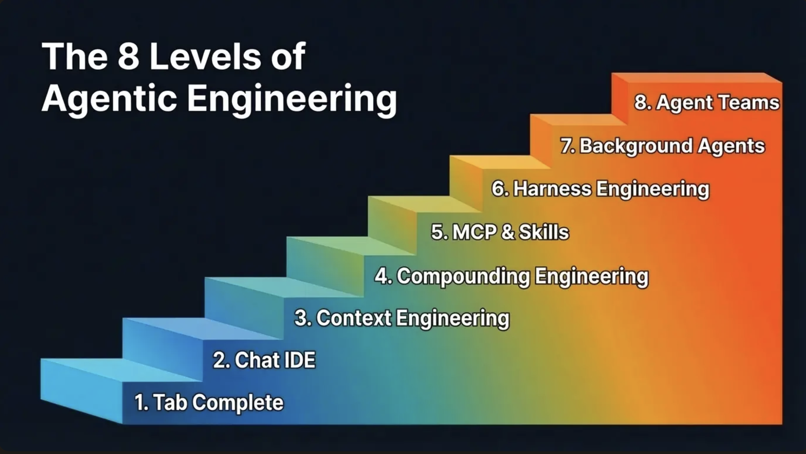

# [Week NINE]{.r-fit-text}

# Agenda
- Presentations: Sai Nikhil; Jesse
- News
- Review whatiknow (everyone)
- Haystack
- Prompt frameworks
- Work time

# Presentations

# News

## Levels of Agentic Engineering
[https://news.ycombinator.com/item?id=47320614](https://news.ycombinator.com/item?id=47320614)

##

## The Batch

$\langle$ pause to look at this week's edition $\rangle$

# WhatIKnow (everyone)

# Haystack
Break into pairs that you haven't worked with before.

## Tutorial components
The tutorial shows you how to create a generative question-answering pipeline using the retrieval-augmentation (RAG) approach with Haystack 2.0. The process involves four main components:

- SentenceTransformersTextEmbedder for creating an embedding for the user query, 
- InMemoryBM25Retriever for fetching relevant documents,
- PromptBuilder for creating a template prompt, and
- OpenAIChatGenerator for generating responses.

## But first, data!
- [quickStart](https://huggingface.co/docs/dataset-viewer/quick_start)
- [tutorialData](https://huggingface.co/datasets/bilgeyucel/seven-wonders)
- Try the Python fragments from the tutorial on the seven-wonders dataset
- If that's successful, try it on your own dataset
- The fragments are *Check dataset validity*, *List configuration and splits*, *Preview a dataset*, and *Get the size of the dataset*.

## Embed documents
- Once you have the data, you can embed it using the `SentenceTransformersTextEmbedder`. This will create an embedding for each document in the dataset.
- You could use a different embedder. Let's look at the list of embedders at [https://docs.haystack.deepset.ai/docs/embedders](https://docs.haystack.deepset.ai/docs/embedders). What you do will depend on the data you choose for your project.
- For now, let's use the default.
- By the way, what is an embedding?
- In its simplest form, an embedding is a vector of numbers that represents (in this case) a sentence. The vector is created by a neural network that has been trained to learn the meaning of the word or sentence.

## Start building the RAG pipeline
- What is RAG, again?
- RAG is a retrieval-augmented generation approach. It uses a retriever to find relevant documents, and then uses a generator to generate a response.
- The pipeline generates a response by combining the retrieved documents with the user query.
- You will use a text embedder for the user's question that matches the document embedder you used to embed the documents.
- You will use a retriever to find relevant documents.
- You will define a prompt template that will be used to generate the response.
- You will use a chat generator to generate the response.

## Initialize the pipeline
- The tutorial has initialization steps for the above components.
- The steps are:
  - Initialize the text embedder
  - Initialize the retriever
  - Initialize the prompt builder
  - Initialize the chat generator

## Build the pipeline
- The tutorial has a build step for the above components.

## Asking a question
- The tutorial has a run step for the above components.
- In this case, a single question is asked.
- The question is: "What does the Rhodes Statue look like?"
- Some examples are given that could be run in a loop.
- Your simple interface to the pipeline is probably going to be a simple loop.
- I'm not going to require any error-handling or user-friendly interface components. You can consider me the only user and I can be given instructions to follow, such as to press Ctrl-D to exit the loop.
- The interface need not be a web-based interface but can be. You are welcome to ask a model to generate a web-based interface but a simple command-line interface is sufficient.

## Other Haystack tutorials
- Although you are not required to use Haystack, you might find it useful. There are many tutorials on the Haystack website, for example:
- [Filtering Documents with Metadata](https://haystack.deepset.ai/tutorials/31_metadata_filtering)
- [Preprocessing Different File Types](https://haystack.deepset.ai/tutorials/30_file_type_preprocessing_index_pipeline)
- [Creating a Hybrid Retrieval Pipeline](https://haystack.deepset.ai/tutorials/33_hybrid_retrieval)

These are Beginner tutorials. There are also Intermediate and Advanced tutorials linked from the same page as the one we just did.

# Prompt Frameworks, @Liu2023

## Prompt Framework Nutshell
{fig-alt="Prompt Framework Nutshell"}

## Background
- Limitations:
  - Temporal lag
  - Lack of capabilities to perform external actions
- Response: variety of prompting tools
- Motivates a survey and classification of tools
- Concept of prompt framework: managing, facilitating, and simplifying interaction with LLMs
- Prompt frameworks operate on different levels: data, base, execute, and service
- Prompt frameworks consist of *core* components and *extend* components

## Prompt Framework Workflow
{fig-alt="Prompt Framework Workflow"}

## Evaluating Prompt Frameworks
- Following slide illustrates the dimensions of the evaluation framework
- Second slide shows the evaluation framework applied to the frameworks

## Prompt Framework Landscape
{fig-alt="Prompt Framework Landscape"}

## Prompt Framework Table
{fig-alt="Prompt Framework Table"}

## Paper history
- @Liu2023 has been updated repeatedly although the Arxiv timestamp is the original submission date
- [GitHub](https://github.com/lxx0628/Prompting-Framework-Survey?tab=readme-ov-file) says the most recent update was 2025-01-14
- But the following timeline goes up to November 2024

## Prompt Framework Timeline
{fig-alt="Prompt Framework Timeline"}

# [END]{.r-fit-text}

# References

::: {#refs}
:::

# Colophon

This slideshow was produced using `quarto`

Fonts are *Roboto* and *Roboto Light*

