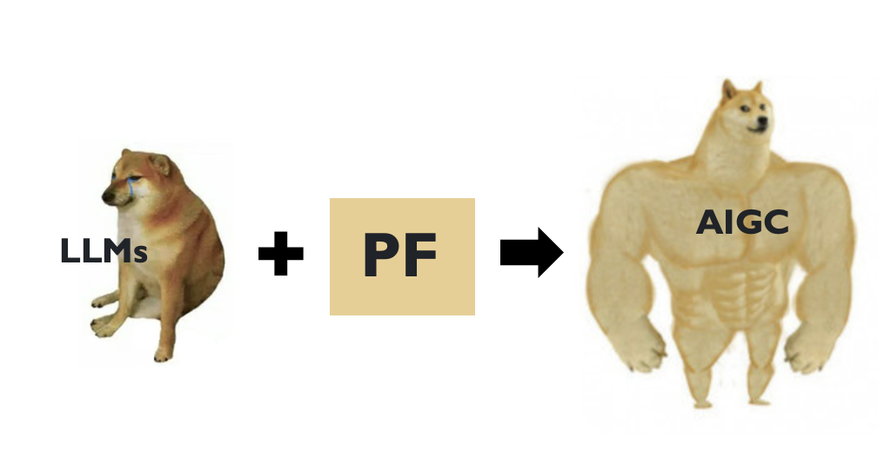
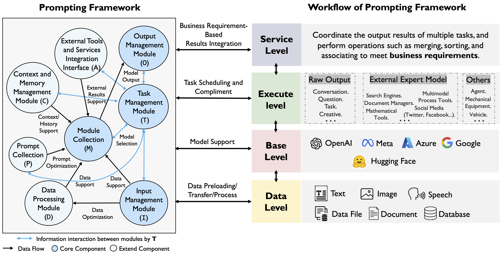
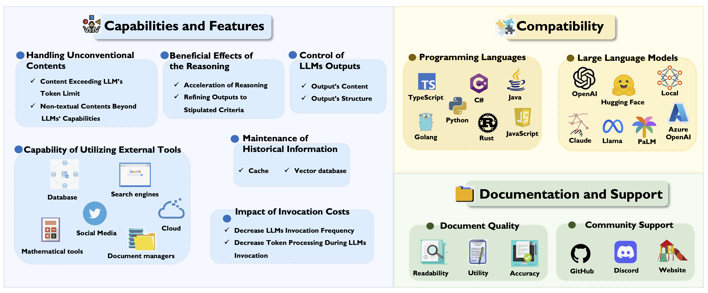
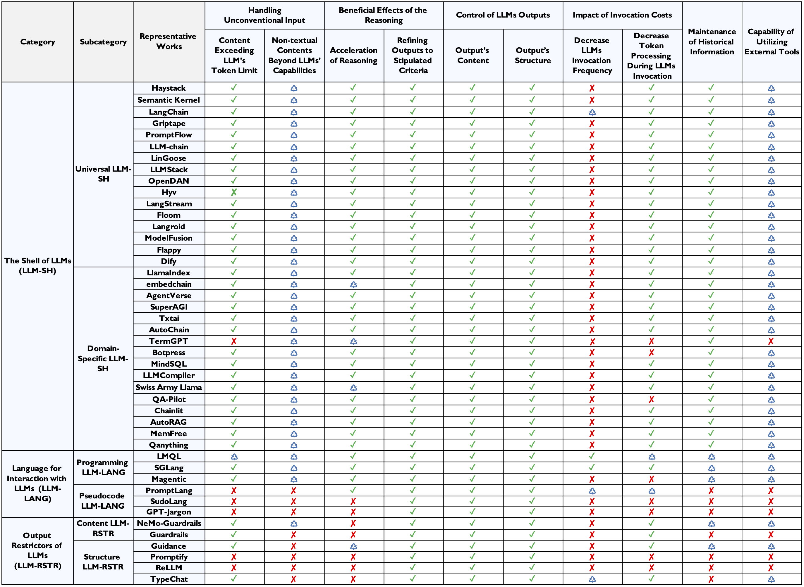
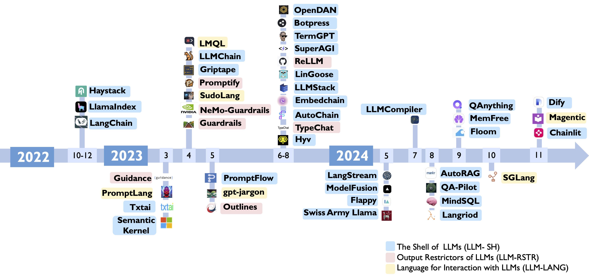

::: {style="position: fixed; font-size: 4em; color: gray;"}
Week Eight
:::

# Agenda
- Presentations: Kylie, Harold, Tianhao
- News
- Review whatialreadyknow (Ishwari)
- Prompt frameworks
- Colab (TACC notebooks)
- Work time

# Presentations

# News

## The Batch

$\langle$ pause to look at this week's edition $\rangle$

# WhatIAlreadyKnow (Ishwari)

# Prompt Frameworks, @Liu2023

## Prompt Framework Nutshell
{fig-alt="Prompt Framework Nutshell"}

## Background
- Limitations:
  - Temporal lag
  - Lack of capabilities to perform external actions
- Response: variety of prompting tools
- Motivates a survey and classification of tools
- Concept of prompt framework: managing, facilitating, and simplifying interaction with LLMs
- Prompt frameworks operate on different levels: data, base, execute, and service
- Prompt frameworks consist of *core* components and *extend* components

## Prompt Framework Workflow
{fig-alt="Prompt Framework Workflow"}

## Evaluating Prompt Frameworks
- Following slide illustrates the dimensions of the evaluation framework
- Second slide shows the evaluation framework applied to the frameworks

## Prompt Framework Landscape
{fig-alt="Prompt Framework Landscape"}

## Prompt Framework Table
{fig-alt="Prompt Framework Table"}

## Paper history
- @Liu2023 has been updated repeatedly although the Arxiv timestamp is the original submission date
- Hence, the following timeline goes up to November 2024

## Prompt Framework Timeline
{fig-alt="Prompt Framework Timeline"}

# Google Colab
$\langle$ pause to run TACC notebooks in Colab $\rangle$

#

::: {style="text-align: right; font-size: 300px; font-weight: bold;"}
END
:::

# References

::: {#refs}
:::

# Colophon

This slideshow was produced using `quarto`

Fonts are *Roboto Light*, *Roboto Bold*, and *JetBrains Mono Nerd Font*

