# [Week TEN]{.r-fit-text}

# Agenda
- Review: where we stand
- Presentation: Jiefang
- News
- Review whatiknow
- Today's plan:
  - Ollama
  - Qwen 3.5
  - Local RAG chatbot
- Work time

# Review

## Where we stand
- Where we stand: time to reflect
- We've been prompting LLMs for nine weeks
- We've learned about prompt techniques developed over the past three years
- We've found that many of them have recently been made obsolete by better models
- We've talked about context and the problems managing it
- We've talked ways of coping with limited context, such as MCP, RAG, and agents

## Prompting challenges
- We've seen a lot of challenges that can't always be met by prompting alone
- But we haven't compared a lot of prompts for the same task
- Let's do that now
- I asked my other class to write a prompt for vibe coding a bill splitter / tip calculator for smartphones
- They produced a surprisingly wide variety of prompts
- I'd like you to analyze them

## First a brutalist prompt {.scrollable}

This splitting and tipping app should be stripped of any modern fluff in favor of a stark, brutalist UI. Built with heavy borders, high-contrast black-and-white layouts, and standard system fonts, the experience centers on a high-speed OCR bill scanner that presents data in a monospace font. Debts are tracked via a radical transparency ledger: a flat, HTML-style table featuring all-caps names and jagged strikethroughs while the Tax & Tip Matrix replaces sliders with massive, color-inverting blocks to calculate either a "Fair" or "Generous" share. Payments are handled through stripped-down, deep-linked alerts that bypass branding, and if a debtor lags, the app issues blunt, plain-text "shame" notifications. To round out its industrial aesthetic, the entire transaction history is archived in a terminal-style monospace log, treating your social dining expenses like a series of mission-critical system events.

##
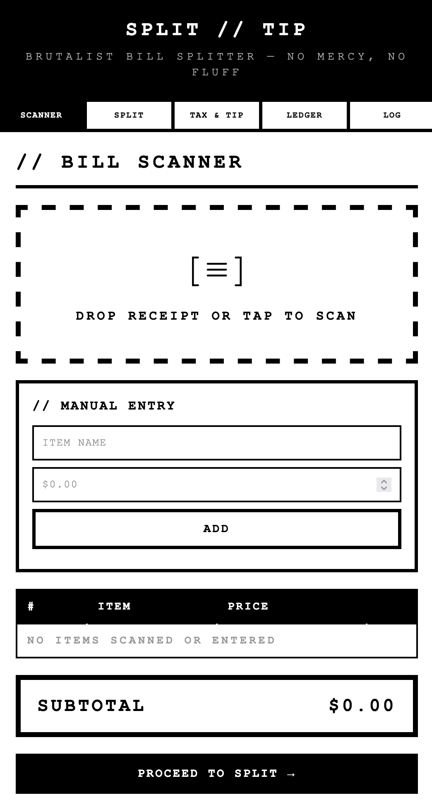

::: {.notes}
This didn't work as intended. I assigned two people and two dishes but the app wouldn't let me associate the people with the dishes.
:::

##
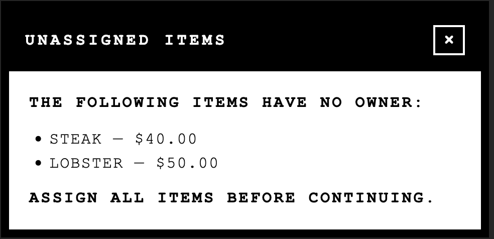

##
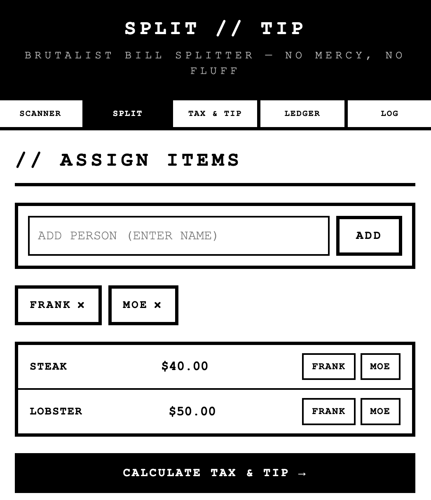

::: {.notes}
Here you can see the screen with the problem.
:::

##
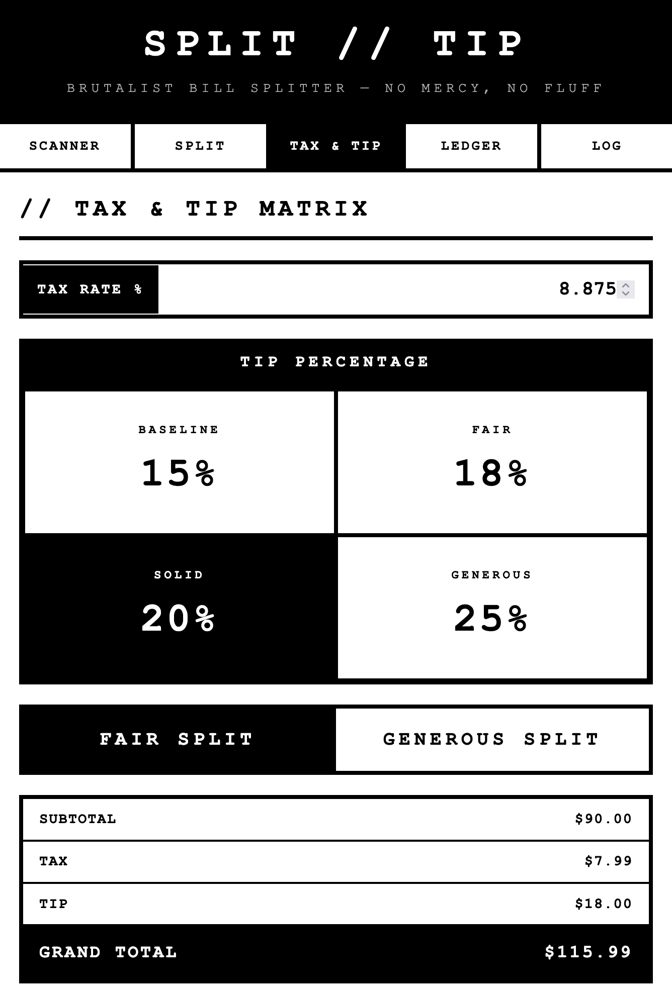

::: {.notes}
Other screens worked fine.
:::

##
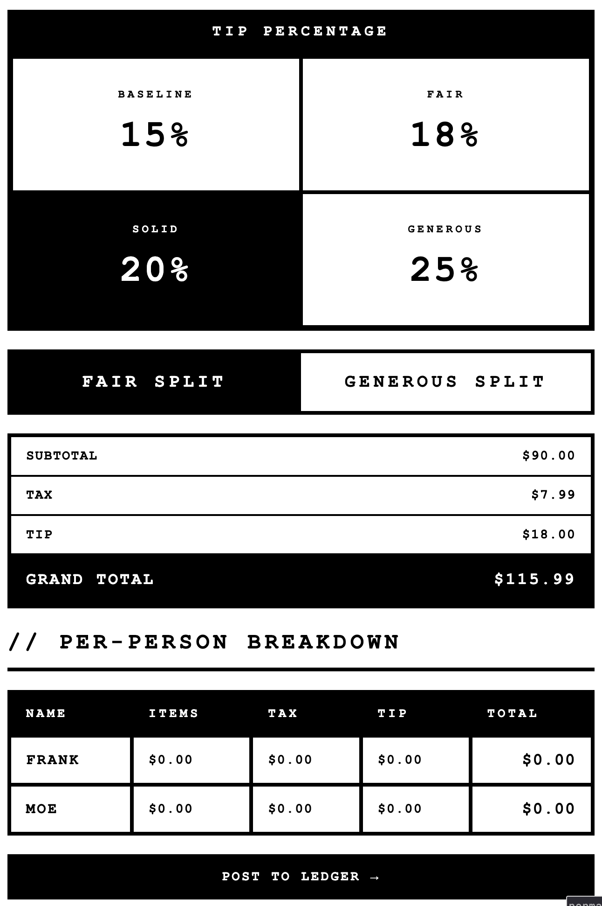

##
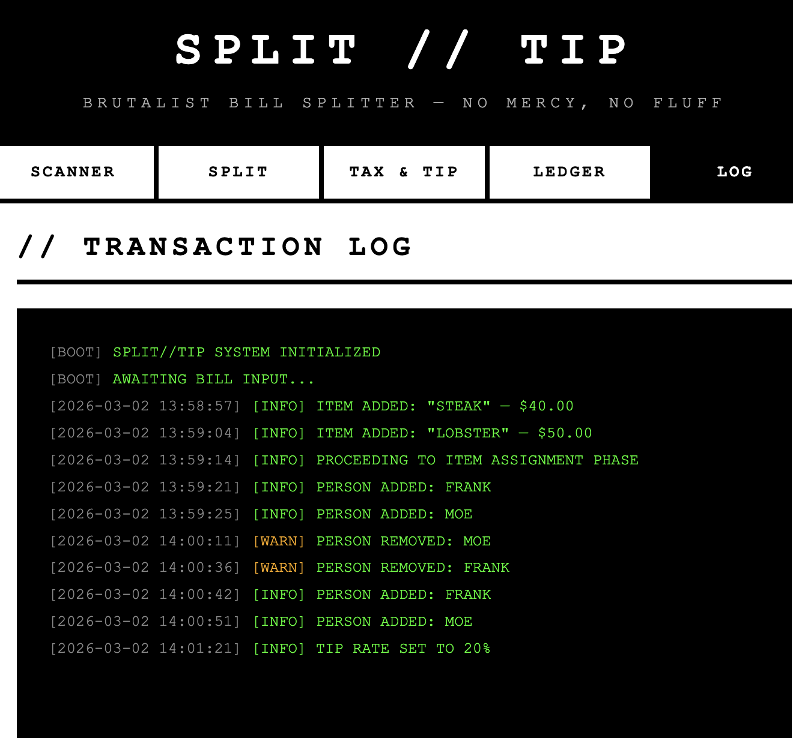

::: {.notes}
In the transaction log you can see that there is no record of my attempts to associate people with dishes.
:::

## A detailed Swift app {.scrollable}

Role: You are a Senior iOS Developer and UX/UI Designer. Your goal is to build a complete, production-ready SwiftUI application called "FairShare."

Task: Code a single-view iOS app that allows users to split a bill and calculate tips. The app must be intuitive, accessible, and follow 2026 Apple Human Interface Guidelines (HIG).

Core Functionality:

Input Section: Large, accessible numeric entry for the total bill amount.

Tip Selector: A choice of common percentages (15%, 18%, 20%, 25%) and a "Custom" option that reveals a slider or fine-tuned stepper.

Splitter: A "Number of People" stepper with a minimum of 1.

Live Results: A prominent "Total per Person" display that updates instantly as inputs change.

Summary Breakdown: A clear list showing: Total Bill, Tip Amount, and Grand Total.

User Experience (UX) Requirements:

Progressive Disclosure: Hide complex options (like custom tip math) until the user requests them.

Micro-interactions: Implement subtle haptic feedback (using UIImpactFeedbackGenerator) when the tip percentage changes or a button is pressed.

Empty State: Ensure the UI looks clean before any numbers are entered (use "0.00" placeholders).

Accessibility: Ensure high contrast, large tap targets, and proper accessibilityLabel support for VoiceOver.

Input Validation: Sanitize inputs to prevent negative numbers or logical errors.

Technical Requirements:

Framework: 100% SwiftUI.

Pattern: Use an MVVM (Model-View-ViewModel) architecture.

Visuals: Use a "Modern Glassmorphism" or "Clean Fintech" aesthetic with Material backgrounds and SF Symbols 6.

Code Quality: Write modular, well-commented code. Separate the Logic (ViewModel) from the View.

Deliverable: Provide the full Swift code for FairShareApp.swift, ContentView.swift, and BillViewModel.swift.

::: {.notes}
To be fair, she used indentation and boldface to make this more readable in a Google doc, but all that formatting was lost when I copied and pasted into Claude Code.
:::

##
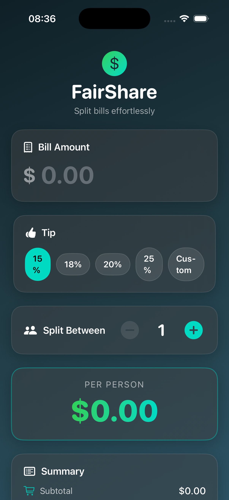

::: {.notes}
Although this was well specified, I couldn't do anything with it out of the box.
:::

## The prompt was simply to ask ChatGPT to write the prompt {.scrollable}

### Role & Objective
Act as a Senior iOS Engineer and UI/UX Specialist. Your goal is to architect and code a complete, modern iOS application named "Splyt"—a premium bill-splitting and tip-calculation tool.

### Core Tech Stack
- Language: Swift 6.0
- Framework: SwiftUI
- Architecture: MVVM (Model-View-ViewModel)
- Design System: Apple Human Interface Guidelines (HIG) 2026 Edition

### Functional Requirements
- Bill Input: Large, accessible numeric keypad for total amount entry.
- Tip Selection: Interactive slider and preset chips (15%, 18%, 20%, 25%) with a "Custom" option.
- Split Logic: Stepper to select number of people (up to 50).
- Tax Toggle: Ability to add/exclude local tax percentages before calculating the tip.
- Summary Card: Real-time calculation of Tip Amount, Total Bill, and "Amount Per Person."
- Rounding Logic: A toggle to "Round Up to Nearest Dollar" for the total or per-person amount.

### UI/UX & Aesthetics (2026 Trends)
- Visual Style: "Glassmorphism 2.0"—use ultraThinMaterial backgrounds, subtle shadows, and high-contrast typography (SF Pro Rounded).
- Haptics: Integrate UIImpactFeedbackGenerator forทุก interaction (slider steps, button presses).
- Micro-animations: Use SwiftUI matchedGeometryEffect for transitions between the input screen and the results summary.
- Dark Mode: Native support with adaptive color palettes (Indigo and Slate).
- Accessibility: Ensure all elements have appropriate accessibilityLabel and accessibilityValue for VoiceOver.

### Technical Implementation Tasks
- Model: Create a BillCalculation struct to handle the math logic.
- ViewModel: Create a CalculatorViewModel using \@Observable (Swift 6) to manage state.
- View Layer:
  - MainCalculatorView: The primary dashboard.
  - Components/NumericPad: A custom-styled keypad.
  - Components/ResultCard: A floating glassmorphic card that updates live.
  - Edge Case Handling: Prevent division by zero, handle extremely large numbers, and ensure decimal precision using Decimal type instead of Double.

### Constraints & Output
- Provide the entire code across separate files (or one clearly commented block if preferred).
- Include a README section on how to implement the "Dynamic Island" support for the active bill summary.
- The code must be "Copy-Paste Ready" for the latest version of Xcode.

## After an interminable conversation with Claude and many bugs ...
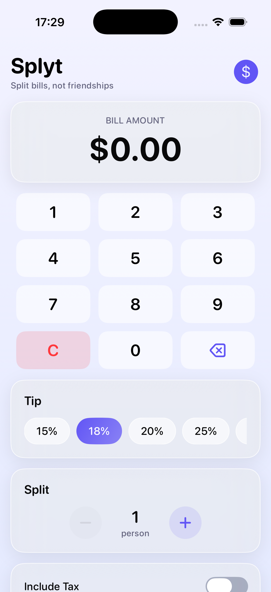

##
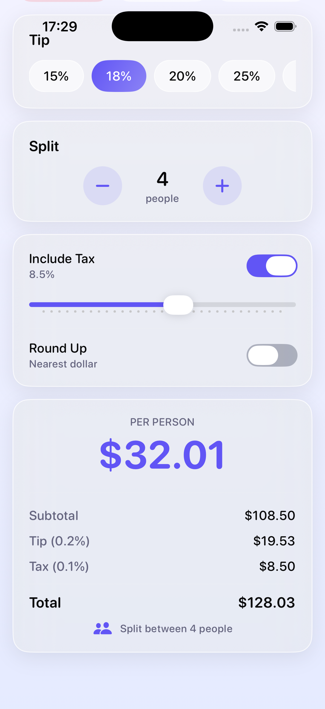

## Another ChatGPT prompt, this time for React {.scrollable}

You are an expert iOS + frontend engineer with strong product and UX judgment.

Build a small, production-ready iOS app using React Native that helps a group of people split a bill and calculate tip quickly and stress-free.

### Context
– Users are friends or small groups at restaurants, often in slightly chaotic, social settings.
– This is a lightweight utility app, opened for less than 1–2 minutes at a time.
– Users may be distracted, so the UI must be instantly understandable.

### Core functionality
– Input total bill amount
– Select or input tip percentage (with sensible defaults)
– Select number of people
– Instantly calculate:
  • Total tip
  • Total bill including tip
  • Amount per person
– Calculations should update live with no extra “submit” step

### Vibe & UX direction
– Friendly, calm, and reassuring -  no financial anxiety
– Soft shadows, rounded corners, muted neutral colors
– Clear hierarchy and large touch targets
– Minimal cognitive load: no clutter, no unnecessary options
– Animations (if any) should feel subtle and purposeful

### Interaction principles
– Prioritize speed and clarity over feature richness
– Avoid modals where possible; keep everything on a single main screen
– Defaults should work for most users without customization
– Make the “per person” amount the visual focal point

### Design constraints
– Use React Native (assume modern iOS versions)
– Follow basic accessibility best practices (readable text, sufficient contrast)
– No external backend required; everything is local state
– Keep the code simple, readable, and well-structured

### Be opinionated
– Make reasonable UX and UI decisions without asking follow-up questions
– Choose sensible defaults for tip percentages and layout
– If tradeoffs arise, explain your reasoning briefly in comments

### Output expectations
– Provide the full React Native code for the app
– Include brief inline comments explaining key design and interaction choices
– Assume this is v1 and focus on a clean, delightful core experience

##
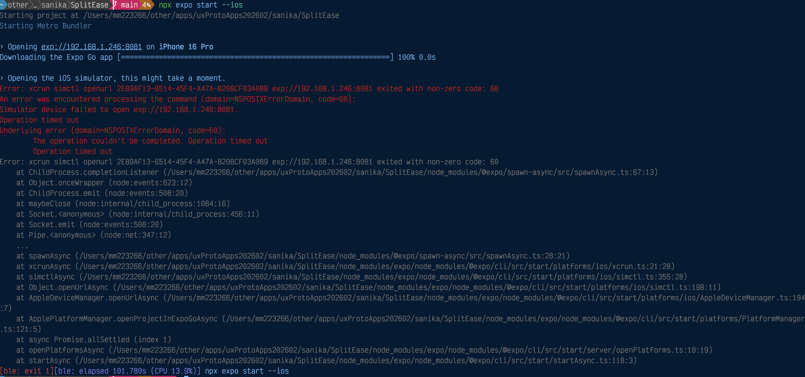

::: {.notes}
Here is some error messaging I got when I tried to run the result.
:::

##
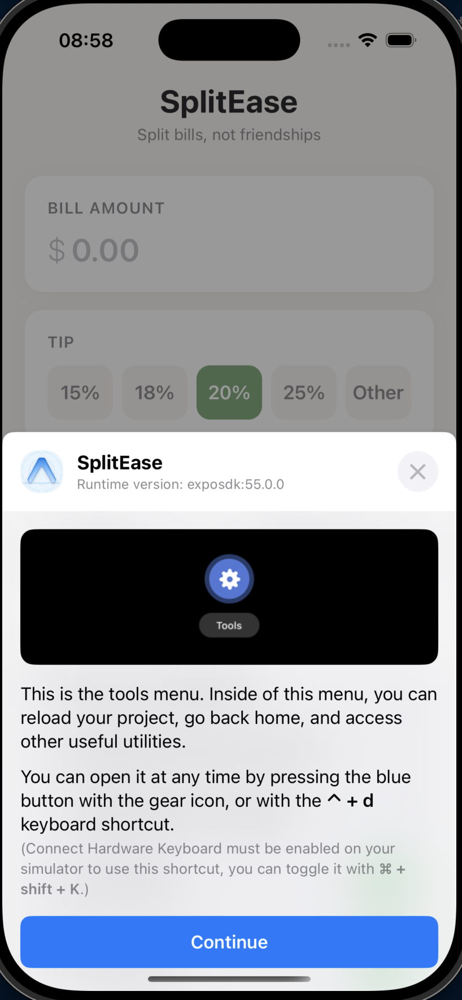

##
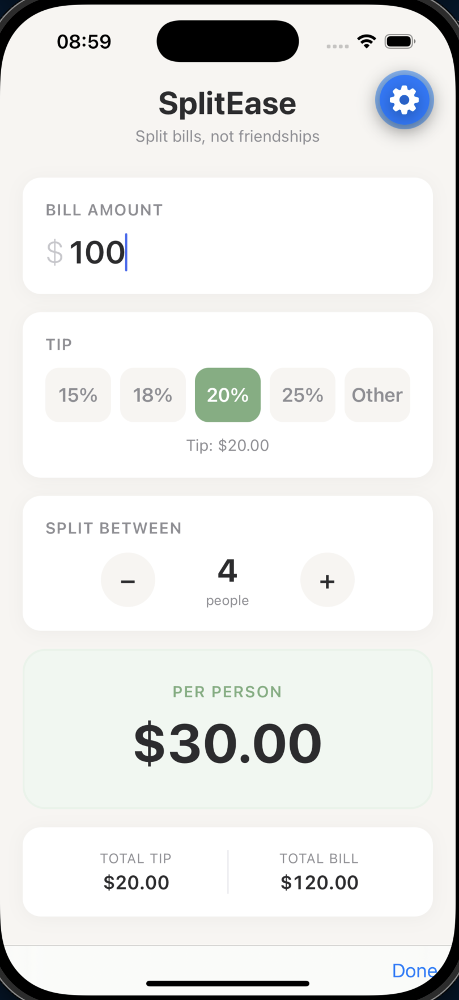

##
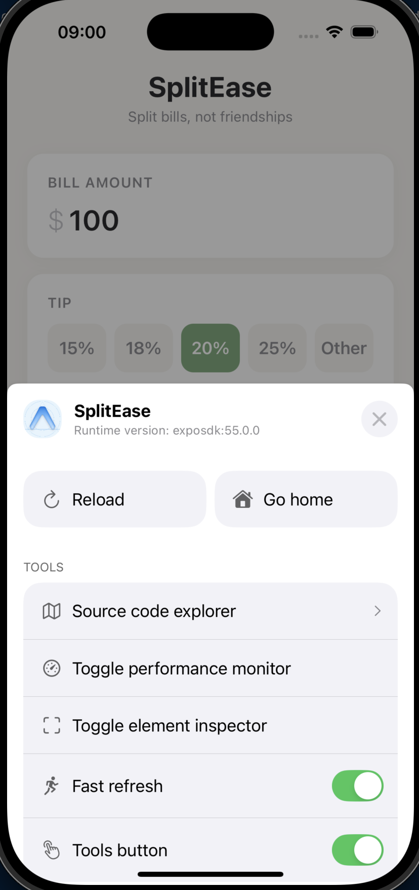

## A short React-focused prompt

Create a React web-based app that is a bill splitter and tip calculator that allows you to input a number, number of people, and a percentage of a  tip to give and the total amount per person showing the breakdown of how much is tip and how much the bill is with taxes, add a color distinction, visual organization, and the option to share the bill for easy communication. 
Colors used should follow WCAG ratio guidelines and separators other than color such as a line that shows a visual distinction between the different parts of the total bill per person. 

##
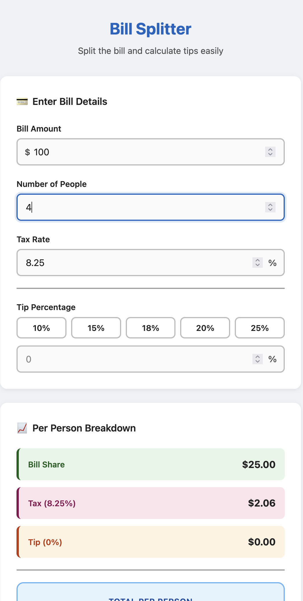

##
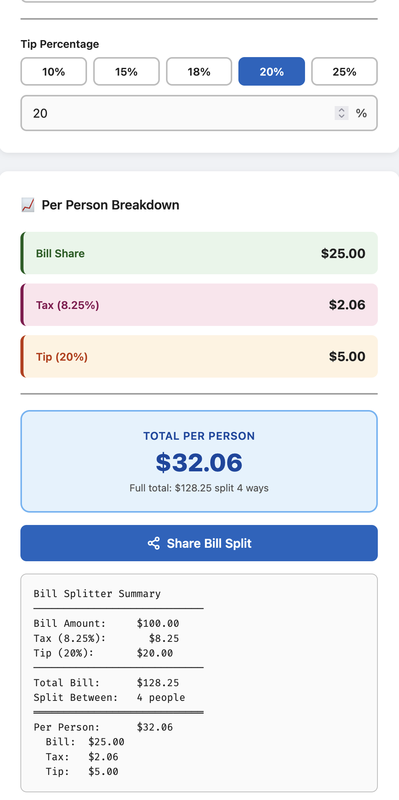

## The shortest prompt, by far!
A simple yet elegant Expo app that splits the bill and calculates the tip.

##
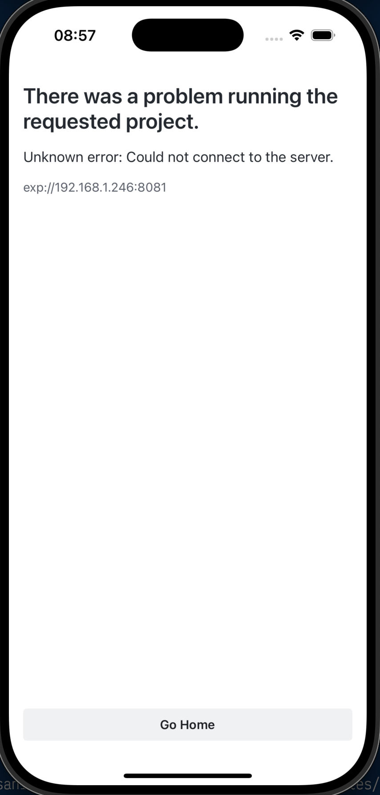

::: {.notes}
This is as far as I got with the shortest prompt.
:::

## SplitEasy {.scrollable}
Build a clean, modern iOS app in Swift using SwiftUI called SplitEasy that calculates bill splitting and tip amounts.

### Core Features
User inputs:
Total bill amount (currency input with proper formatting)
Tip percentage (default 18%, allow custom input + preset buttons 15%, 18%, 20%, 25%)
Number of people splitting the bill (stepper control, minimum 1)
Automatically calculate
Tip amount
Total bill including tip
Amount per person

### Live updating:
All calculations should update in real time as inputs change.
UI Requirements
Use SwiftUI
Clean, minimal, Apple-native design
Large readable typography
Card-style layout sections
Proper spacing and padding
Support light and dark mode
Use iOS system colors
Use keyboard type .decimalPad for money input
Add a toolbar “Done” button to dismiss keyboard

### Technical Requirements
Use MVVM architecture
Create:
ContentView
BillViewModel
Use \@StateObject for ViewMode
Validate numeric input safely
Prevent crashes from invalid text input
Use computed properties for calculations
Format currency using NumberFormatter
Avoid UIKit unless absolutely necessary
Bonus Features (if possible)
Round up per-person amount toggle
Persist last used tip percentage using \@AppStorage
Add subtle animation when totals change
Add haptic feedback when calculation updates

### Deliverables
Provide:
Full Swift code (ready to paste into Xcode)
File structure explanation
Brief explanation of architecture decisions
Comments in code explaining key logic
Make the code production-quality, clean, and well-structured.

##
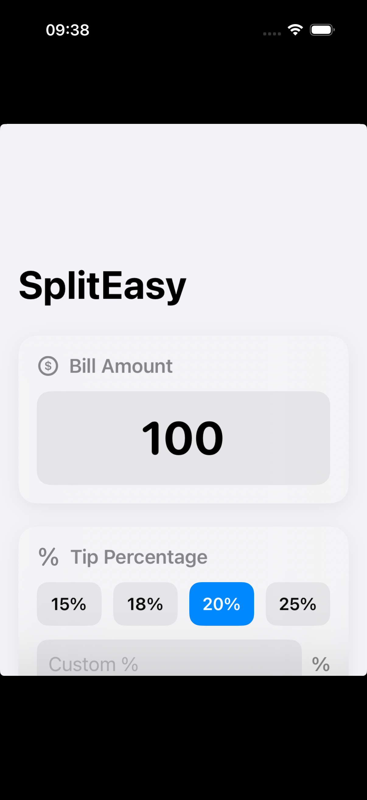

##
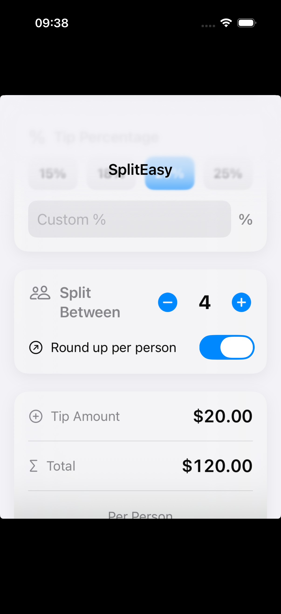

## One last app
I can't remember which prompt produced it!

##
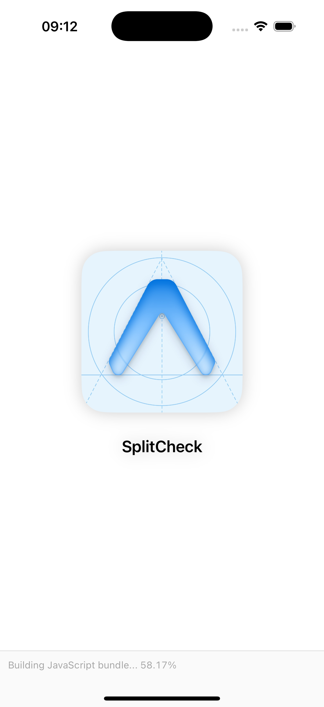

##
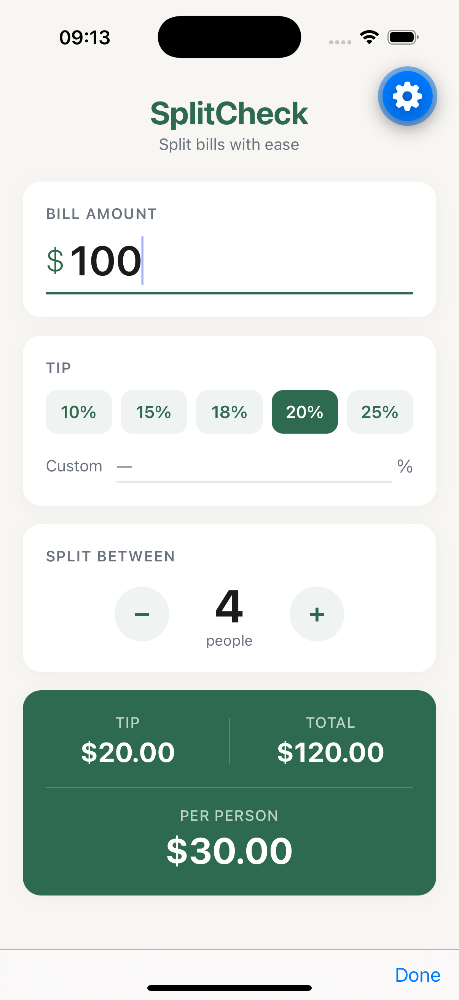

## Takeaways
- You need to be somewhere on the spectrum from vibe coding to agentic engineering
- There is a skill associated with it---you can't just expect out of the box success
- Claude (and probably ChatGPT and maybe Gemini) is getting vastly better at this than it was a couple of months ago
- You can't do it well for free or even close to free
- You need a premium account (200USD/mo) for the best integration with Xcode, and probably the best integration with other developer tools
- Therefore students and inexperienced designers are at a disadvantage compared to experienced designers whose companies pay for their accounts

## More Takeaways
- Short prompts yield unpredictable results
- Development knowledge greatly improves your prompts and speeds the process
- You need to be a good debugger rather than a good developer
- Vibe coding is an iterative process---you have to be ready to hold a conversation with the AI to get what you want
- There are plenty of vibe coding "tools" on the market that all use the same two models, Claude or ChatGPT (maybe Gemini but I'm not sure)
- Connecting Figma and Claude in a two-way street works best as of March 2026


# Presentation

# News

## AI in the Courts
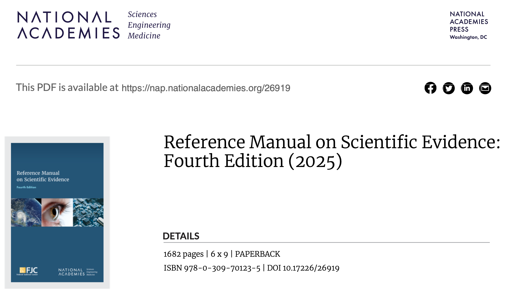

## AI in the Courts
- The above captioned reference manual, @NASEM2025, is meant for judges
- The US government keeps a copy of it online (minus the chapter about climate science!)
- The value for this class is the very detailed AI chapter, which includes an overview of AI for the layperson, as well discussions of ethics, especially bias
- It is written by legal scholars, not computer scientists
- You can download a copy from the US government's website (without the chapter on climate science) or the full copy from the [National Academies of Sciences, Engineering, and Medicine website](https://nap.nationalacademies.org/26919)

## Autonomous Learning
- We looked at lmlm (pronounced "lam-lam"), a way to compartmentalize knowledge so that an LLM doesn't grow stale long after training
- A completely different approach is outlined in a new paper, @Dupoux2026, which proposes that LLMs should keep learning after training
- The architecture is just a proposal at this stage, but it could be influential
- Let's look at the architecture, but first ...

##
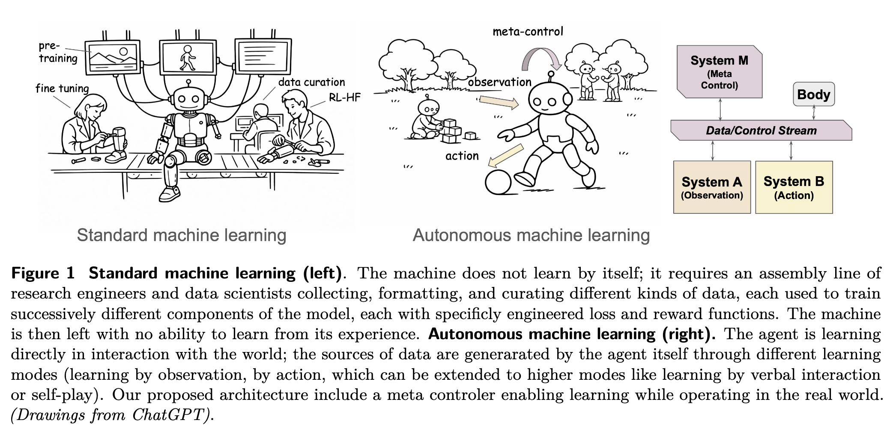

##
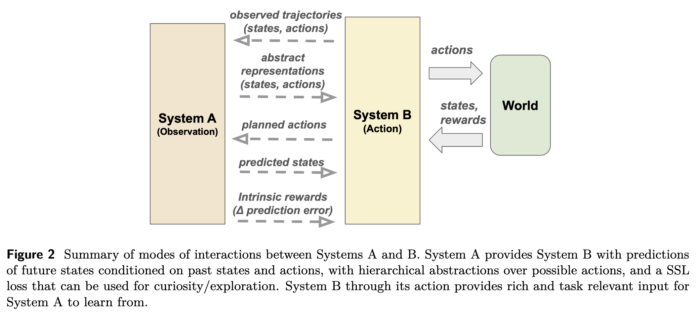

##
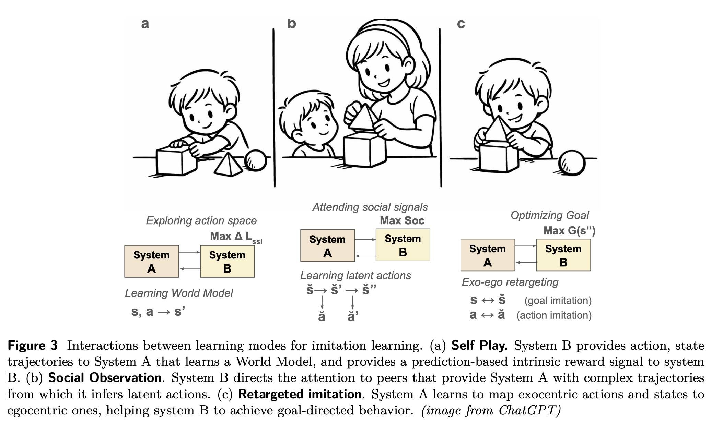

##
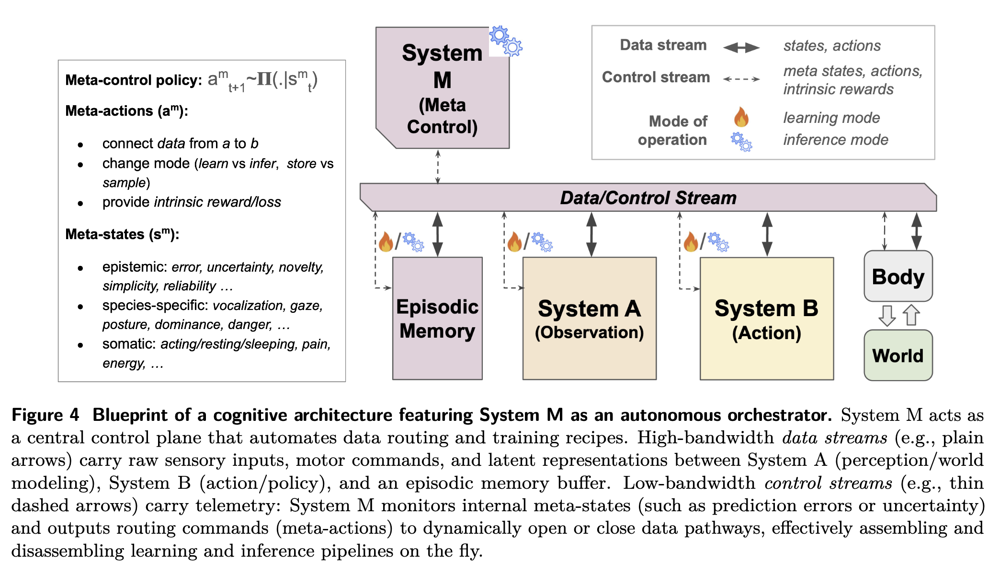

## AI and diagrams
Last semester in week 10, we looked at AI diagramming as follows:

*It's worth looking at the AI and diagrams article that was posted to Hacker News, along with the HN comments, which are more generally focused on prompting techniques. The article discusses the use of AI to generate diagrams, and concludes that it's good for simple diagrams and brainstorming, but struggles with complex diagrams and diagrams of systems that require insights into the system that are not well-documented.*

[https://news.ycombinator.com/item?id=43398434](https://news.ycombinator.com/item?id=43398434)

It may be worthwhile to see how things have changed (or not).

## TikZilla
- Instead of drawing diagrams interactively, you can write programs to draw diagrams with TikZ. Since genAI is good at writing code, writing TikZ code might be a good approach.
- A recent paper, @Greisinger2026, describes a tool called TikZilla, which is a tool for generating TikZ code from natural language descriptions and correcting faulty TikZ code.

##
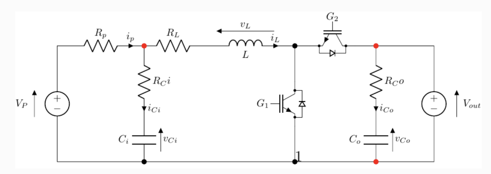

## The code that was supposed to produce it

```latex
Published as a conference paper at ICLR 2026
LLM-based TikZ Debugging
Original TikZ Code:
\documentclass[tikz]{standalone}
\usepackage[utf8]{inputenc}
\usepackage{circuitikz}
\usepackage{float}
\usepackage{calc}
\begin{document}
\begin{circuitikz}[american, straight voltages]
\draw (-1,0)
to [american voltage source, v=$V_P$, invert, voltage shift=1] (-1,4)
to [R, R=$R_p$, i^>=$i_p$] (2,4)
to [R=$R_L$] (4,4)
to [L, l_=$L$, v^<=$v_L$, i=$i_L$, voltage shift=1.5] (7,4)
to [Tnigbt,bodydiode] (10,4)
to [short] (12,4)
to [american voltage source, v^<=$V_{out}$, voltage shift=1] (12,0)
to [short] (-1,0)
(2.0,4) to [R=$R_Ci$, i=$i_{Ci}$] (2.0,1.5)
to [C, l_=$C_i$, v^<=$v_{Ci}$] (2.0,0)
(7.2,4) to [Tnigbt,bodydiode, invert] (7.2,0)
(10.0,4) to [R=$R_Co$, i=$i_{Co}$] (10.0,1.5)
to [C, l_=$C_o$, v^<=$v_{Co}$] (10.0,0)
(8.5,5) node[align=center]{$G_2$}
(6.1,2) node[align=center]{$G_1$}
(7.2,0) node[circ, scale=1.5]{$1$}
(7.2,4) node[circ, scale=1.5]
(2,0) node[circ, scale=1.5]
(2,4) node[circ, color=red, scale=1.5]
(10,4) node[circ, color=red, scale=1.5]
(10,0) node[circ, color=red, scale=1.5]
;
\end{circuitikz}
\end{document}
```

## TikZilla fixed that code in one pass
- TikZ is used within LaTeX
- Several other packages for drawing from code exist
- Mermaid, GraphViz, PlantUML, and others can be augmented by LLMs in general or,etter still, by specialized tools like TikZilla
- If you have to draw complicated diagrams, it pays to look for one of these tools

## A TikZ example of mine
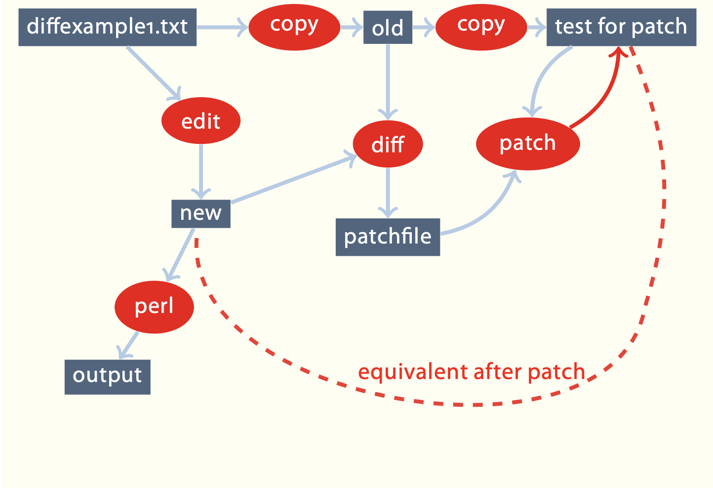

## Another TikZ example of mine
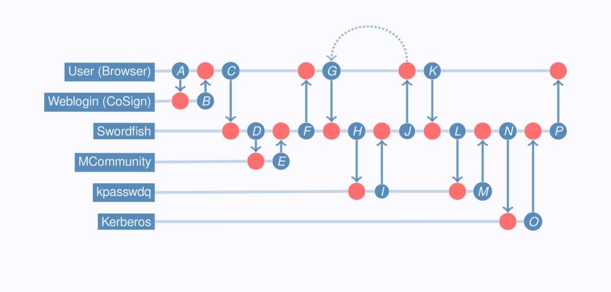

## The Batch
Last week's edition:

- Andrew Ng on *insecurity*
  - Andrew says no one knows the future of software, especially the leaders in the field
  - He suggests focusing on community and durable skills
- The war in Iran and the role of AI
- Qwen 3.5!
- DeepSeek Snubs Nvidia for Huawei
- A single tokenizer for all visual media

# WhatIKnow

# Today's plan
Today we'll create a local RAG chatbot, using Ollama, Qwen 3.5, LangChain, ChromaDB, and Gradio.

We'll have to install a lot of stuff and we'll have to use the `localRAGchatbot.qmd` file after we do some installations.

# Ollama
Ollama is an open-source framework designed to facilitate the deployment of large language models on local environments. It aims to simplify the complexities involved in running and managing these models, providing a seamless experience for users across different operating systems. (source: nixos wiki)

## Download and Install Ollama

Visit Ollama’s [website](https://ollama.ai) for detailed installation instructions, or install directly via Homebrew on macOS:

```bash
brew install ollama
```

For Windows and Linux, follow the platform-specific steps provided on the Ollama website.

::: {.notes}
These and the following instructions come from the workos [blog](https://workos.com/blog/how-to-run-deepseek-r1-locally)
:::

# Qwen 3.5
Qwen 3.5 was in the news last week for running on small local installations and rivalling much larger models

## Fetch Qwen 3.5

Pull the Qwen 3.5 model onto your machine:

```bash
ollama pull qwen3.5:9b
```

This downloads the 9B Qwen 3.5 model (which is 6.6GB). If you’re interested in a specific distilled variant, or the full model just specify its tag, obtained from [https://ollama.com/library/qwen3.5](https://ollama.com/library/qwen3.5)

```bash
ollama pull qwen3.5:27b
```

## Run Qwen 3.5

Do this in a separate terminal tab or a new terminal window:

```bash
ollama serve
```

You must keep this terminal window open. In other words, you must keep Ollama running while you're using Qwen 3.5.

## Start using Qwen 3.5.

Once installed, you can interact with the model right from your terminal:

```bash
ollama run qwen3.5:9b
```

Or, to run the 27B model:

```bash
ollama run qwen3.5:27b
```

Or, to prompt the model:

```bash
ollama run qwen3.5:9b "What is an LLM?"
```

## Model location

On my machine, the model manifest is located at

```bash
~/.ollama/models/manifests/registry.ollama.ai/library/qwen3.5/9b
```

The model itself is located at

```bash
~/.ollama/models/blobs
```

divided across several files. The name `qwen3.5` is important because that is the name used by Ollama to refer to the model. If you store other models, they will be stored in this structure and can be accessed by name.

You can verify that you have the 9B model by saying

```bash
ls -lh ~/.ollama/models/blobs
```

One of the blob files should be about 6.2GB.

::: {.notes}
 The file names are long hash keys and only matter if you think your download was corrupted.
:::

## Also needed
You will also need `nomic-embed-text` because Qwen3.5 is not an embedding model. You can use `nomic-embed-text` to create an embedding from `Xiao2025.pdf`. So say

```bash
ollama pull nomic-embed-text
```

# The chatbot
We now turn our attention to the `localRAGchatbot.qmd` file. You must download that file from Canvas, along with `Xiao2025.pdf`. This latter file is a book, @Xiao2025.

The first thing to do is to copy and paste the `pip install ...` commands into a terminal window. Then you can try to render the `localRAGchatbot.qmd` file in RStudio.

If you can't render the file, there may be several reasons. The first thing to try is to download the `localRAGchatbot3.py` file and try to run that in Python by saying `python localRAGchatbot3.py` at a terminal prompt. It takes about seven minutes to run on my machine. If that doesn't work, the problem may be in your Python installation. If it does work, the problem may be in your RStudio installation.

# [END]{.r-fit-text}

# References

::: {#refs}
:::

# Colophon

This slideshow was produced using `quarto`

Fonts are *Roboto Light*, *Roboto Bold*, and *Victor Mono Nerd Font*

