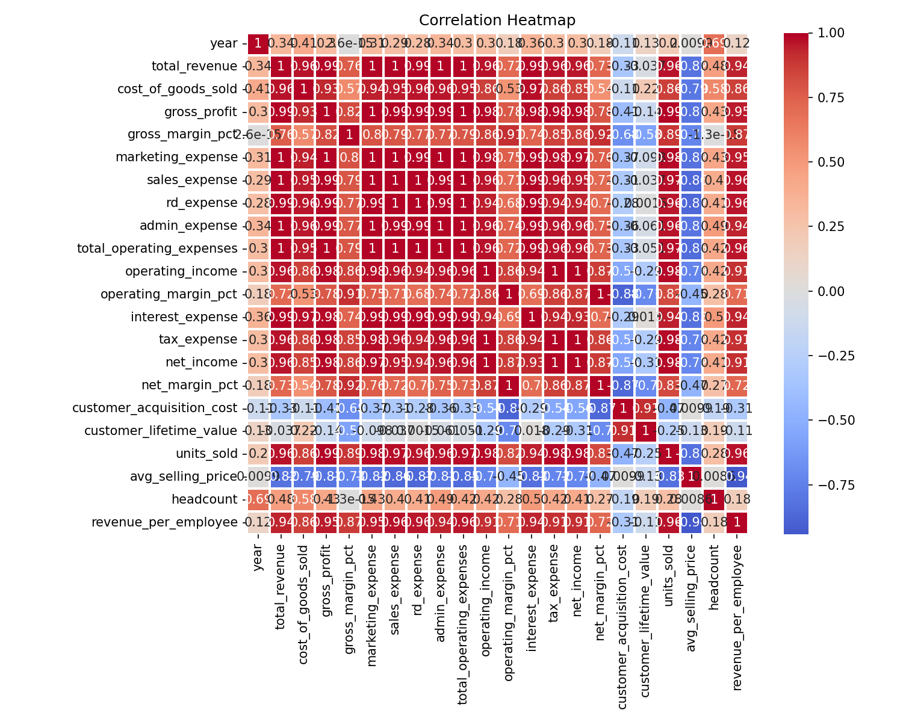
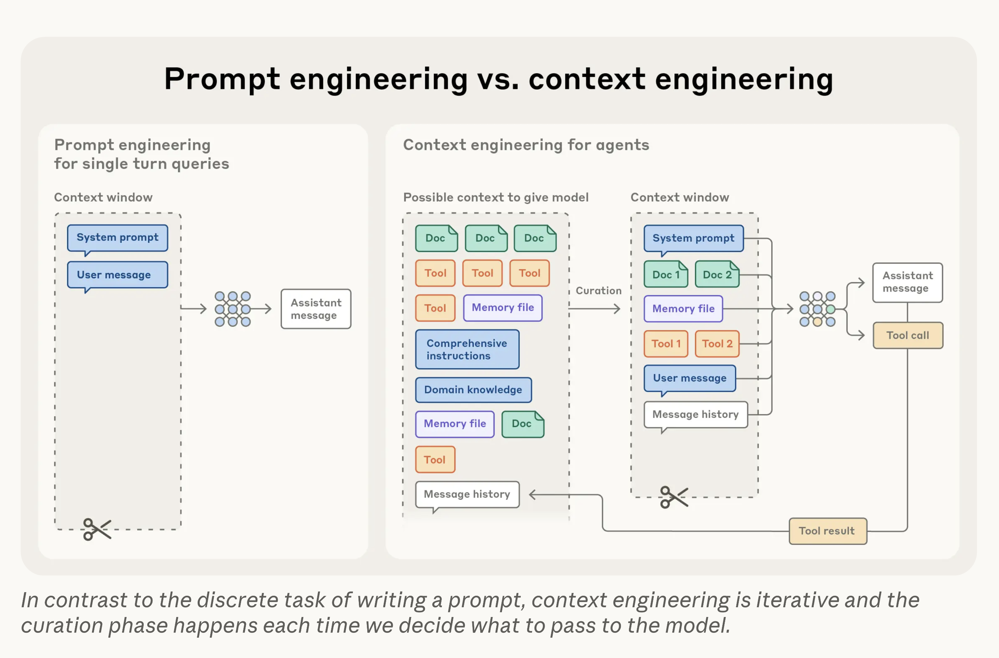
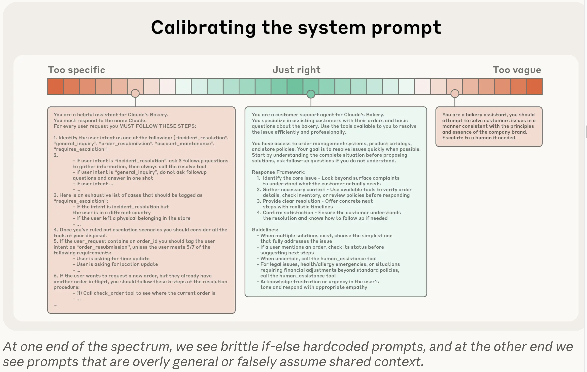

# [Week ELEVEN]{.r-fit-text}

# Skills

## Of what are skills an example?

*Context engineering*

## Why use skills?

- Easy to set up
- *progressive disclosure*
  - Saves tokens
  - Attenuates *context rot* [https://research.trychroma.com/context-rot](https://research.trychroma.com/context-rot)
- Good for validating, structuring, and automating AI output
- Best for high-repetition, specialized tasks

## What are skills?

A skill is a package, fed to Claude as a zip file containing a folder structure. At a minimum, it contains a folder named for the skill with a file inside that folder called `SKILL.md`. Everything else is optional. Note that the `SKILL.md` file must be properly formatted as a markdown file with YAML frontmatter containing the skill's *name* and *description*.

## Skill structure

For example, it might contain a subfolder called *scripts* with Python or Bash scripts. It might contain additional context in a markdown file. It might contain data in a `.csv` file. None of this is read unless the prompt and the *name* or *description* field triggers it, saving tokens.

- name-of-skill/
	- SKILL.md
	- scripts/
		- validate.py
	- additional_context.md
	- data.csv

# What skills are built in to Claude? (type `/skills`)

| Skill | Description |
|---|---|
| /update-config | Configure Claude Code settings — hooks, permissions, env vars, and settings.json changes |
| /keybindings-help | Customize keyboard shortcuts and rebind keys in ~/.claude/keybindings.json |
| /simplify | Review changed code for reuse, quality, and efficiency, then fix issues |
| /loop | Run a prompt or slash command on a recurring interval (e.g., `/loop 5m /foo`) |
| /schedule | Create and manage scheduled remote agents that run on a cron schedule |

## Prepackaged skills

[https://github.com/anthropics/skills](https://github.com/anthropics/skills)
I wanted more prepackaged skills to try, so I cloned the Anthropic Skills Repo

I asked Claude where to put it and it suggested `~/.anthropic/skills/`

I checked the Claude documentation about where to put it and it suggested `~/.claude/skills/`

It offered to make the directory and put the files there, by the way. This raises a typical problem for LLMs: it is typically faster to do a one-off task yourself rather than ask the LLM. The LLM (and Skills in particular) excel at automating repeated tasks.

## Which skill to try?
Skill Creator is perhaps the most popular of Anthropic's packaged skills, but I wanted something related to homework D, so I found a different repo through the following directory.

[https://github.com/ComposioHQ/awesome-claude-skills?tab=readme-ov-file](https://github.com/ComposioHQ/awesome-claude-skills?tab=readme-ov-file)
A list of some (allegedly) curated skills can be found here

I selected the CSV skill to try, since the data for hw D is in CSV format.

First I tried a built in example but it was a bit difficult to assess the results because I didn't know the data.

The graphics it generated looked ridiculous on the face of it, but I needed to look at the data to be sure.

## A ridiculous graphic

## Another ridiculous graphic

## Yet another ridiculous graphic

## Visidata
Next, I tried looking at the data with `Visidata`, a cli tool I typically use for examining CSV files. Claude was helpful here, because it just had a three-letter month and four digit year in separate columns. Claude wrote a Python script to convert those into standard dates (the first of each month).

##
$\langle$ Pause to view Visidata $\rangle$

## Ames example

Next I tried the Ames data

It called a fairly good Python script to analyze the data but again produced ridiculous graphics.

$\langle$ Pause to view Ames analysis $\rangle$

##

##

##

##
Can we fix these? Yes, if we know some Python, we can tell it what graphics to use. Even without knowing Python, we could limit the correlation heatmap to, say, the four most and least correlated variables.

On the other hand, if we know Python, it may be better (not faster as a one-off but better for routine use) to create our own Skill and Python script.

## More about skills
[https://news.ycombinator.com/item?id=45786738](https://news.ycombinator.com/item?id=45786738) discusses Claude Code in general but with an emphasis on Claude Skills.

# The bigger picture

::: {.notes}
This and the following material comes from Anthropic and is meant as guidance for Claude but is really more general.
:::

## Details
- The more general rationale is *context rot*
- With $n$ tokens, the transformer architecture tracks $n^2$ relationships
- There needs to be *just* enough context
  - Too much -> context rot
  - Too little -> overly generic answers
- Strive for the minimal (not necessarily short) amount of information that satisfies your needs
- Iteration is necessary to get it *just right*

##

## How to get *just enough*
- Start with a prompt you know to be too short
- Gradually add to it
- Gradually add context
- Gradually add *tools*

## Tools
- Tools allow you to use agents and can minimally occupy context
- Tools should promote efficiency of tokens and efficiency of agent behavior
- Tools should be non-overlapping, self-contained, robust to error, and with clear boundaries of use

## Examples (few-shot prompting)
- Examples should be diverse but not cover every edge or corner case
- Too many examples and if-then constructs are common errors

## Agents
- Anthropic defines the agent paradigm as LLMs autonomously using tools in a loop
- The more capable the model, the more autonomous the agent can be
- Agents maintain lightweight identifiers such as file paths, stored queries, and web links to load data into context at runtime using tools
- Example: Claude Code uses the bash commands `head` and `tail` to look at the beginnings and ends of files rather than loading the entire files
- Example: an agent perceives the file `tests/test_util.py` differently from `src/core_logic/test_util.py` without having to examine the actual files

## Tradeoff
- It's faster to have all the context up front rather than discover it incrementally
- But it's often more effective to spend time at run-time to gather only the most relevant context
- A hybrid strategy often works best as with Claude, retrieving the CLAUDE.md file up front but using tools to capture additional context
- Tools can determine file sizes, names, timestamps, and other relevance clues
- The hybrid strategy is not for everything---may work best in legal and financial settings, where the environment is not too dynamic

## Long horizons
For tasks involving tens of minutes to hours of continuous work, several techniques exist to cope with the fact that context windows will definitely be exceeded

- Compaction: distilling a nearly full context window into a hifi summary and using that to create a new context window, now not nearly full
- Structured note-taking: aka agentic memory, involves the agent writing notes that can be later brought back into the context window as needed
- Multi-agent architectures: aka sub-agent architectures, where each sub-agent has its own context window and can use that to perform elaborate tasks, returning only a small result consisting of 1,000--2,000 tokens

## Which technique works best?
- Compaction works best when there is a lot of back-and-forth conversation
- Note-taking works best for iterative development with clear milestones
- Multi-agent architectures work best when parallel exploration is possible, e.g., research and analysis



