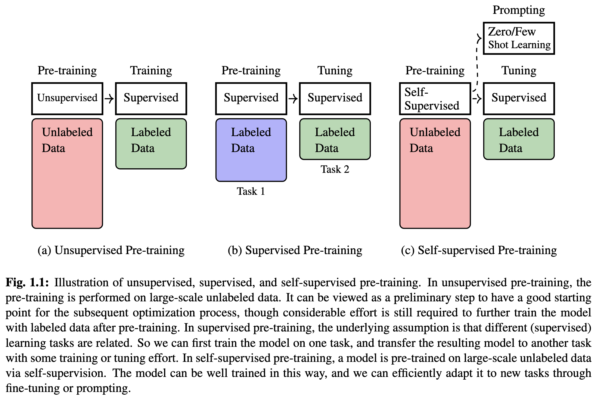
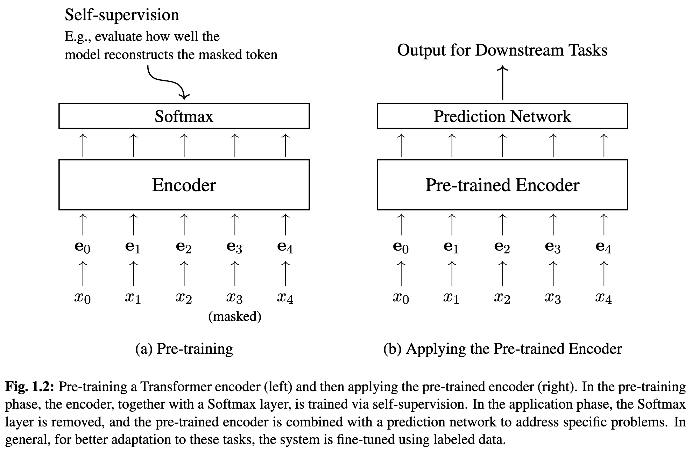
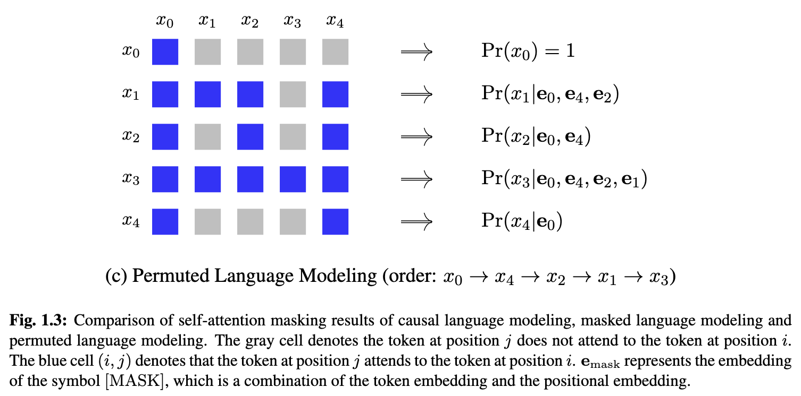
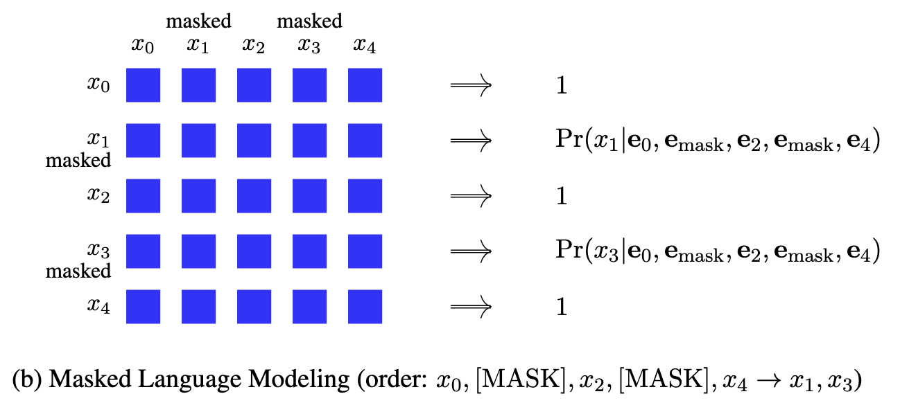
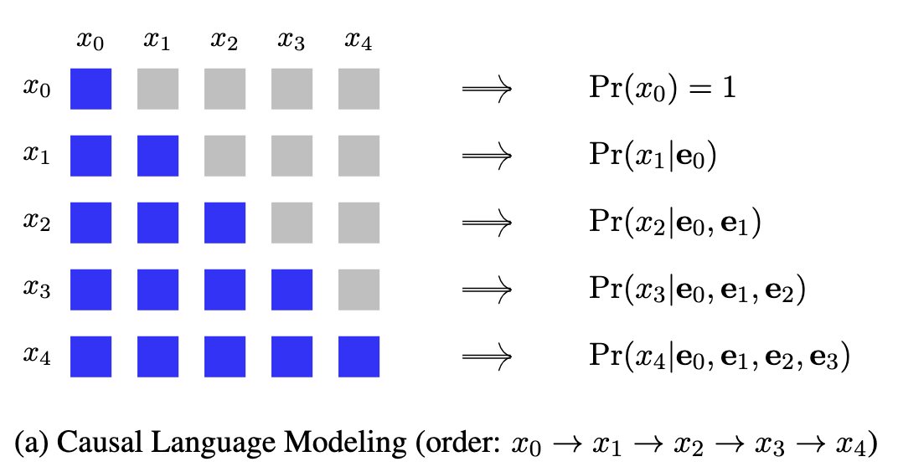
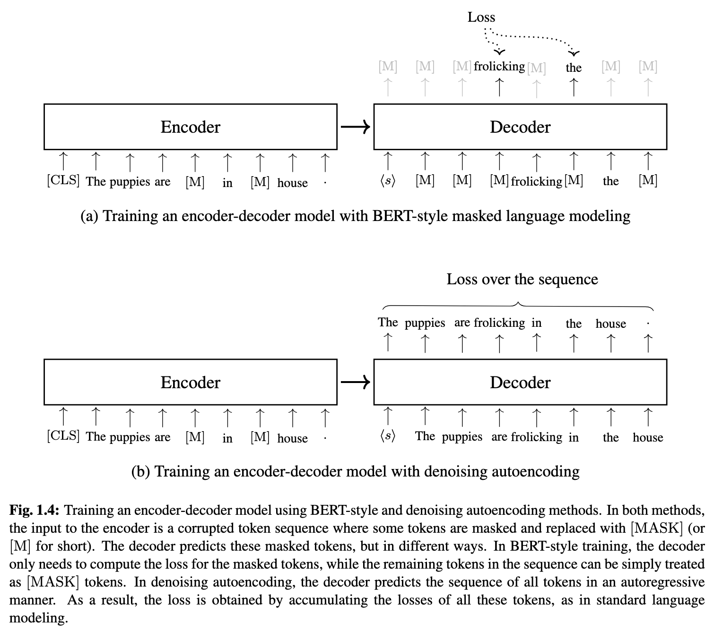
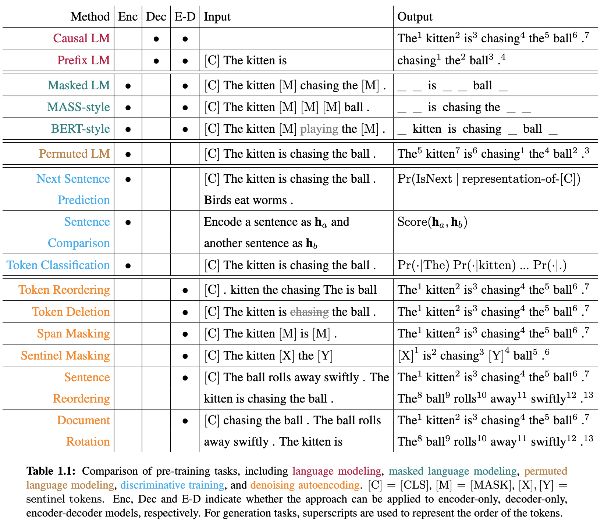
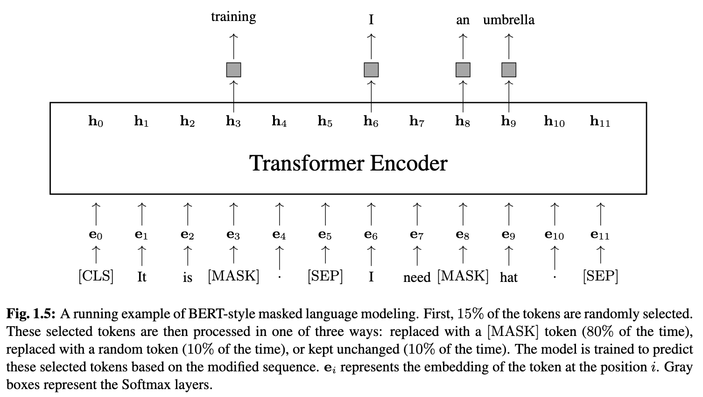
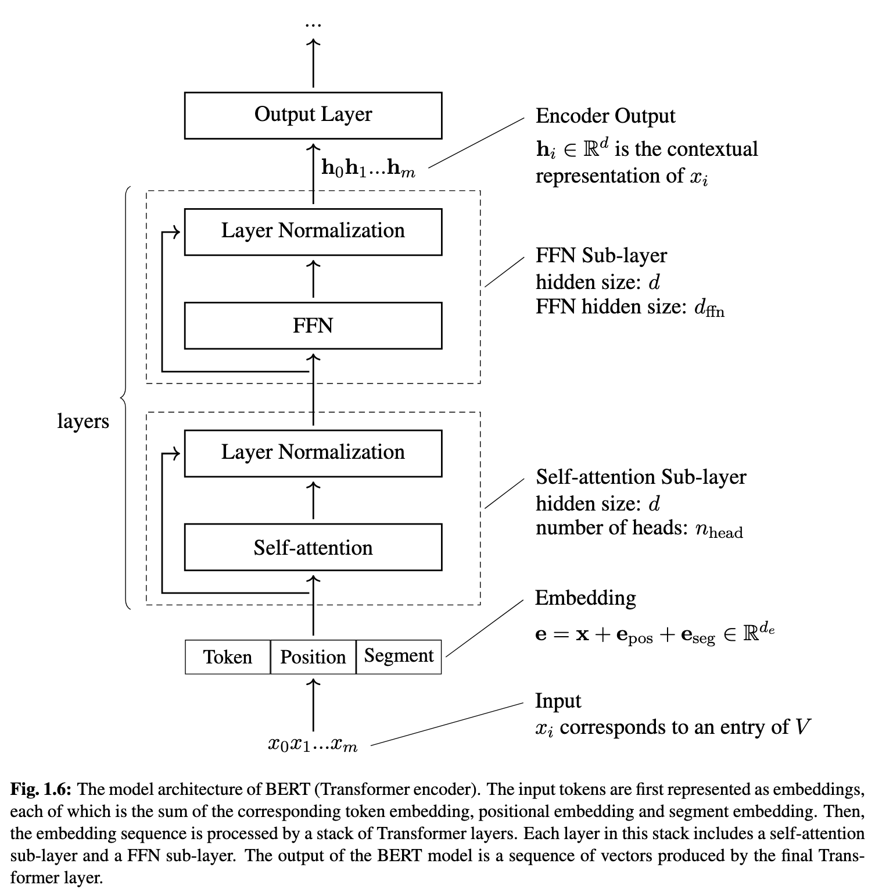
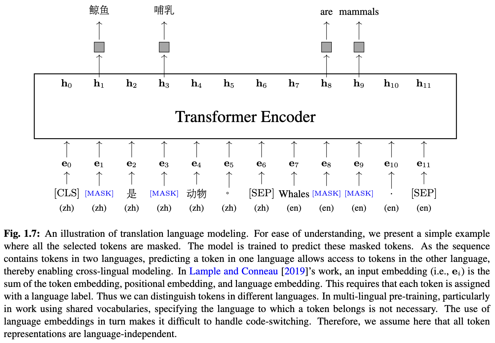

# [Week TWELVE]{.r-fit-text}

# Presentation from Hitanshi

# News
- Claude Mythos (advanced cybersecurity)
- Google's AI Overviews are 91 percent accurate
- OpenAI, Google, Anthropic collaborate against Chinese "copycatting"
- Companies everywhere are grappling with a flood of code
- OpenAI is courting retail investors

## The Batch
- Voice Interfaces
  - intelligence latency tradeoff
  - written communication has high reliability but high latency
  - voice interfaces have low reliability and low latency
- Claude Code source code reveal
- Discontinuation of Sora (already discussed)
- Lyria 3, Google's music generator
- TTT-E2E compresses context, training at inference time

## Data Points
- NeurIPS v China
- "Emotions" discovered in Claude
- Gemma 4 (possibly better and smaller than what we did last week!)

## Simon Willison
You should definitely check Simon Willison's logs of his interactions with AI to build things---excellent sources of prompting guidance

# Whatiknow

# Iterative Prompting
- Students may overly rely on zero-shot prompting. Why?
- Classroom specifications may not be stringent enough to require iteration.
- How can we simulate the more stringent requirements of the real world in the classroom?
- We can introduce a capricious, demanding client.
- I will play that role, going around the room and critiquing your results from each prompt.
- You will do a task, in this case, vibe-coding the bill-splitter / tip calculator (unless someone has a better idea) and I will not accept it as is.

## Iterative Prompting Exercise
- Vibe-code the bill-splitter / tip calculator
- Put a screenshot (or screenshots) of your app into the `vibe coding artifacts` assignment box
- Put a transcript of your llm interactions, named `llm.txt`, into the same box
- Put a copy of the client demands, named `client.txt`, into the same box

# Pretraining

## Why Pre-training?
So far, we've talked a lot about skills and applications, but not so much about fundamental concepts. Now let's turn our attention to @Xiao2025 to learn about fundamental concepts. This is because if we only look at skills and applications, we may overlook *why* certain things happen. If we examine the fundamentals and see why things happen, we can better extrapolate the examples to our future experiences.

## Some prereqs
This chapter mentions several concepts that come from different domains

- vectors and matrices: columns (or rows) and arrays of numbers (linear algebra)
- maximum likelihood estimation: finding parameter values that make observed data most likely under some assumed model (statistics)
- gradient descent: an optimization algorithm that finds the minimum of a function by iteratively moving in the direction of the steepest decrease in the function's value (calculus)
- arg max $f(x)$: the input $x$ that produces the maximum value of a function, not the maximum value itself (applied mathematics)
- one-hot representation: vector of all zeroes except one (linear algebra)

## Pre-training
@Xiao2025 covers a lot of ground but begins with pre-training before explaining the foundations of LLMs. They focus on NLP (natural language processing) tasks because these tasks are where many breakthroughs were made.

Note that they're mostly talking about transformer models, which were introduced in the famous paper *Attention is all you need* in 2017, although pre-training is much older.

## Outline
- Kinds of pre-training
  - Unsupervised pre-training
  - Supervised pre-training
  - Self-supervised pre-training
- Self-supervised pre-training tasks
  - decoder-only pre-training
  - encoder-only pre-training
  - encoder-decoder pre-training
- Example: BERT

## Labeled and unlabeled data
We assume that it's harder to obtain labeled data than unlabeled data due to the effort involved in labeling. For example, if we want to classify tweets as positive, negative, or neutral, we can ask humans to label some (which constitutes supervision) and use that data as input to a related task, such as rating product reviews as positive, negative, or neutral. This exemplifies supervised pre-training.

Unsupervised pre-training occurs without a human in the first phase, but humans in the training phase.

Self-supervised pre-training (without a human) allows us to go to a second phase involving a human doing prompting or training.

##

## Two kinds of NLP models
- Sequence encoding models
- Sequence generation models

## Sequence encoding models
- Encodes a sequence of tokens (roughly words) as a vector (embedding)
- Input to other models, such as classification systems

## Sequence generation models
- Given a context, generate a sequence of tokens
- Context examples (not exhaustive)
  - Preceding tokens in language modeling
  - Source-language sequence in machine translation

## Fine-tuning
- Typical method for sequence encoding models
- Happens after pre-training
- Fine-tunes a pre-trained model for a given task, such as classification, using labeled data
- Example: build a system with an encoder then a classifier (next frame)
- Tokens are $x_0, \ldots, x_4$ 
- Embeddings are ${\bf e}_0, \ldots, {\bf e}_4$ 
- Softmax converts raw results into probabilities

## Prompting
- Typical method for sequence generation models
- Most prevalent example is the large language model
- Simply predicts the next token given preceding tokens
- Repeating task over and over enables learning general knowledge of languages
- Can convert many NLP tasks into simple text generation through prompting
- Zero-shot learning involves performing tasks not observed in training
- Few-shot learning involves provision of *demonstrations*, samples that demonstrate how input corresponds to output

# Self-supervised pre-training tasks
- decoder-only pre-training
- encoder-only pre-training
- encoder-decoder pre-training

## decoder-only pre-training
- Used with LLMs
- Predict the next token from previous tokens
- Uses a formulation equivalent to maximum liklihood estimation
- If the pre-trained data is large enough, it acts as a gold standard distribution of probabilities of tokens at a given position
- Can define a loss function between the gold standard and the model's prediction

## encoder-only pre-training
- Exemplified by BERT
- Bidirectional, not good for autoregressive text prediction
- Good for classification, named entity recognition

##

## encoder-decoder pre-training
- Original transformer technique
- Uses encoder to process input birectionally
- Uses decoder to generate output autoregressively

## Masked language modeling
- Basis for BERT
- Create prediction challenges by masking some tokens and training the network to predict them
- May have unmasked tokens on the left or right, so the model is bidirectional
- Predictions are made based on both the left and right contexts
- Two problems:
  - Uses special token, called [MASK], introduced in training but not testing
  - Autoencoding overlooks dependencies between masked tokens

## Permuted language modeling
- Addresses above problems
- Predictions can be made in any order
- Can be easily implemented in transformer models due to self-attention mechanism
- Self-attention computes how much each token should attend to each token (including itself) to determine meaning

## Notes on the next three frames
- The notation $(i,j)$ means the cell in row $i$, column $j$ of a matrix
- $\textrm{Pr}(x_m|{\bf e}_n)$ means the probability of token $x_m$ given the presence of embedding ${\bf e}_n$
- The three frames are shown in reverse order, from the most sophisticated (permuted---any order) to the least sophisticated (causal---left to right) with masked in between

##

##

##

## Pre-training encoders as classifiers
- Next sentence prediction, described in BERT paper
  - Trained using actual consecutive sentences vs randomly sampled sentences
- Applying classification-based supervision signals to each output of an encoder
  - Uses a *generator* and a *discriminator* to first generate a new sequence then determine whether that sequence is altered from the original sequence

## Masked encoder-decoder pre-training
- Many tasks can be cast as text-to-text with a source and target
- Examples include translation, question answering, simplification, and scoring of translations
- Encoder-decoder pre-training has been applied to language models
- Also masked language modeling
- Two approaches in following frame

##

## Denoising training
- Training encoder-decoders can be seen as training denoising autoencoders
- Many methods to corrupt input include masking some input, altering some input, rearranging input
- May mask individual tokens by [MASK] token or a span of tokens by a [MASK] token
- Span could actually have length zero
- If the sequence is multiple sentences, we can reorder the sentences or rotate the entire document

## Comparing pre-training tasks based on training objectives
- Language modeling
- Masked language modeling
- Permuted language modeling
- Discriminative training
- Denoising autoencoding
- Following table illustrates these---colors based on objectives not models

##

# BERT
- Originally presented in Devlin (2019)
- Originally a transformer encoder trained using two tasks (1) MLM---masked language modeling and (2) NSP---next sentence prediction
- Loss used in training is the sum of the losses of the two tasks
- Many variants proposed since then

## Loss functions in BERT
- Most BERT models represent a sentence or a sentence pair
- Thus can handle many downstream language understanding tasks
- Usually compute loss functions (MLM and NSP) separately

## MLM
- Original BERT selects random fifteen percent of input tokens
- Of those, eighty percent are masked, ten percent are randomly replaced, and ten percent are left unchanged
- Example in next frame (note that [CLS] is a start token and [SEP] is a token that ends sentences)

##

## BERT architecture
- Standard transformer encoder
- Input is embedding as sum of token embeddings ${\bf x}$ (one of 30,000 in original BERT), positional embeddings ${\bf e}_{\textrm{pos}}$ (where in the sequence the token occurs), and segment embeddings ${\bf e}_{\textrm{seg}}$ (which sentence the token belongs to)
- Many transformer layers, each layer having a self-attention sub-layer and a feed-forward network sub-layer
- Illustrated in next frame

##

## Improving BERT
- Two methods are common
  - Increase training data and build larger models
  - Increase number of parameters
- Also common to try to increase efficiency so smaller models work as well
  - Pruning (removing layers or parameters)
  - Quantization (representing parameters as low-precision numbers)

# Multi-lingual models
- BERT originally focused on English
- mBERT trains on 104 languages
- Cross-lingual pre-training involves bilingual examples
- Also called translation language modeling, illustrated in next frame

##

## Applications of BERT-like models
- Classification
- Regression
- Sequence modeling
- Span prediction
- Encoding portion of encoder-decoder models

## Fine-tuning problem
- Fine-tuning on different data may lead to catastrophic forgetting
- Common solution is to include some old data in fine-tuning
- Specialized solutions include experience replay and elastic weight consolidation, neither of which are covered in the book

## Summary
- General idea of pre-training
- Specifically, self-supervised pre-training applied to three architectures: encoder-only, decoder-only, and encoder-decoder
- Large scale pre-training enables LLMs, but we haven't yet discussed LLMs


