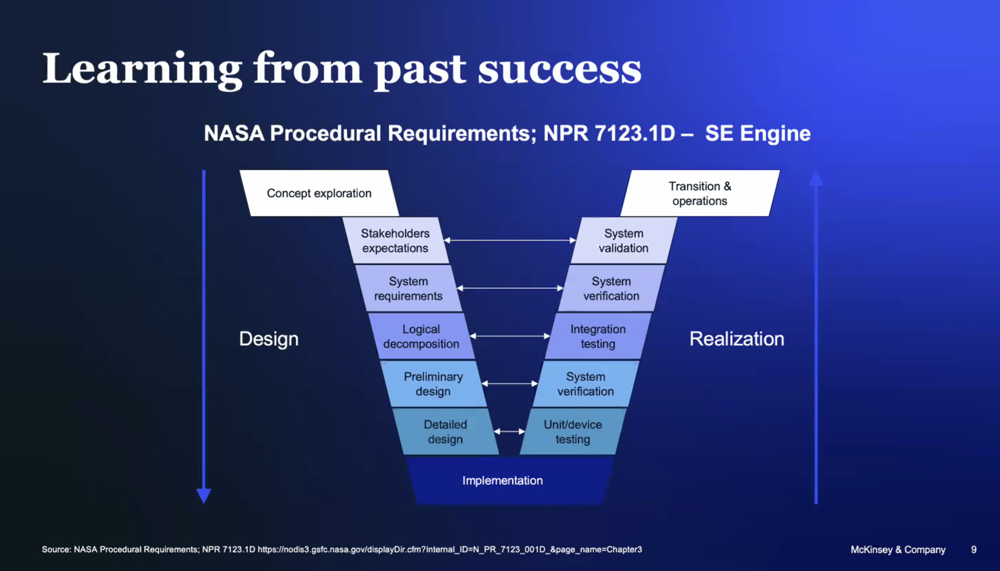
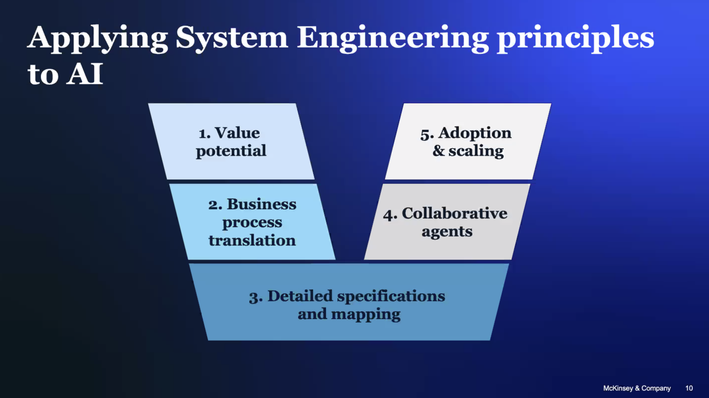
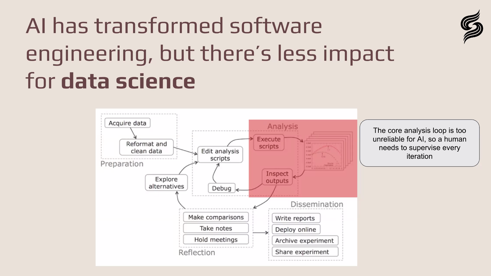
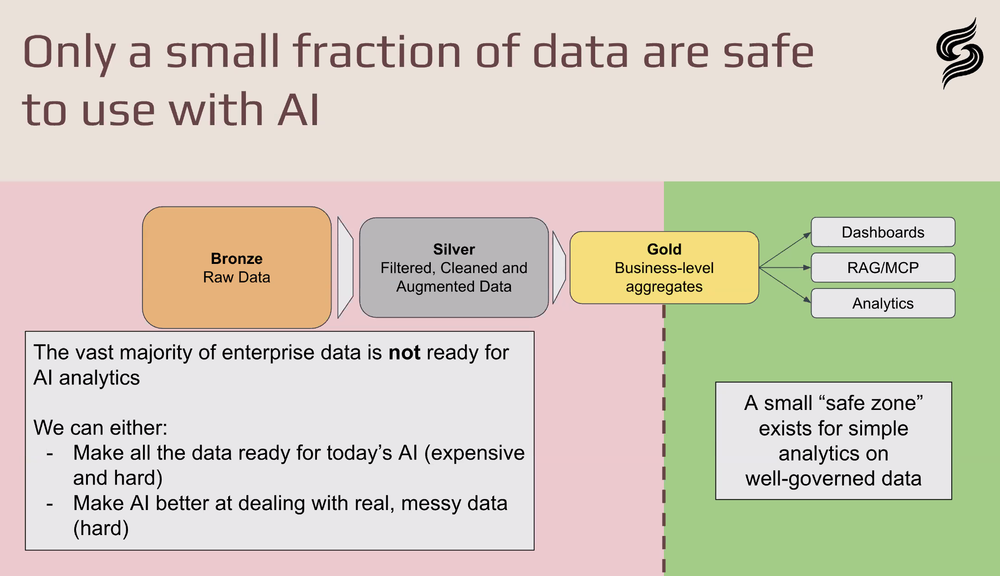
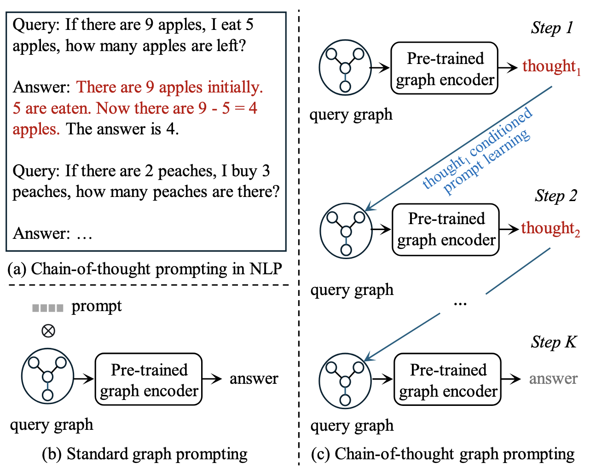
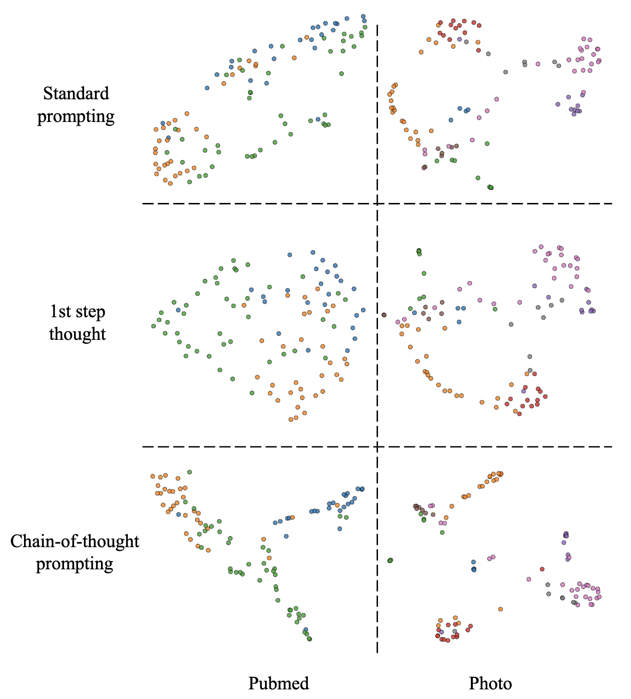
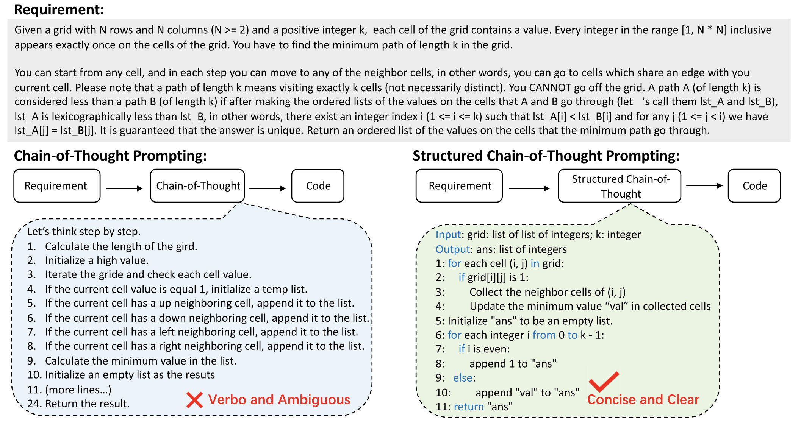
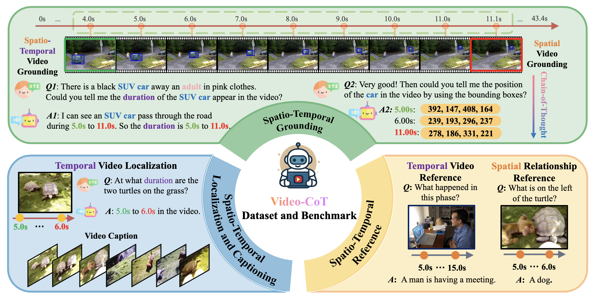

# [Week THIRTEEN]{.r-fit-text}

# First, an Agentic-AI conference
- You need to know about these things
- That said, this one had a lot of business fluff ... circling back to leverage our proactive synergies for a win-win
- I want to highlight one of the presentations to warn you and to highlight one presentation and one panel that were helpful

## McKinsey presentation
- McKinsey is the world's most prominent business strategy consulting firm
- Presenter said it's really a tech firm in disguise and would like to consult with all of us on our AI strategies
- Presented a lot of statistics on CEO attitudes toward AI
- They evidently talk to a lot of CEOs who are mostly clueless about AI but are otherwise very smart people
- Based a lot of his presentation on the following two frames

## The NASA antecedent

::: {.notes}
Not to be mean but these are the guys who brought you the Challenger and the Columbia. You have to be willing to scrutinize their claims. I have an acquaintance who designs satellite payloads and says he will never use NASA to launch the satellites because they are hidebound by tradition and don't understand the details of why they do things the way they do.

If this particular diagram looks suspiciously like a waterfall, it's because it is! The waterfall has a bad name, so they turned it into a V to make it look like progress. It isn't progress. It suffers from the same flaws as the waterfall process.
:::

## How McKinsey adapted the NASA diagram

::: {.notes}
Now see what McKinsey did. They simplified the process to make it more tractable and based the rest of the presentation on these steps. When asked about an iterative process, the presenter said they iterate all over the place. Iteration is good. So what? Iteration is really only good if it replaces the staged, no-going-back character of the waterfall process. There's really no reason for this process. It's an oversimplification of an outmoded idea meant to appeal to the C-Suite (to which the presenter repeatedly referred.)

The main takeaway is that AI must add to the firm's bottom line, which reminds me of the cartoon of people sitting around the campfire saying, "Sure, we destroyed civilization but we created a lot of value for shareholders first."
:::

## A useful panel on vibe coding
- The expression *vibe coding* was coined by Andrei Karpathy in February
- In November, it was selected as "Word of the year" [sic] by some dictionary
- The panelists were all enthusiastic vibe coders
- I'll upload a video to Canvas when it's made available to me
- Main takeaway is, as always with AI, realistic expectations
- Disagreement exists over degree of coding skill needed to effectively vibe code, but these people were all experienced coders before they began
- Some agreement that, by pursuing test-driven development, vibe coding can be useful for debugging (contradicts some earlier wisdom)

## A useful presentation on data representation for AI
- Presenter was founder of Sphinx, which helps you massage data so AI can use it
- Points out that, while genAI works for text and images, it does not do well on tabular data---needs agentic tools, which Sphinx conveniently provides
- Gave an excellent example of genAI failure with the Ames dataset which you used for exercise D
- Showed some interesting graphics, displayed in the next two frames

## Data science benefits less from genAI than does software engineering

## Data in different states

::: {.notes}
Presenter makes the point that you can either fight a Sisyphean battle to make data into gold standard data, or teach genAI to work with messy data; obviously his product helps with the latter alternative
:::

# Chain of Thought prompting
- One student asked for some coverage of chain-of-thought (CoT)
- I thought it might be useful to survey a few recent papers on CoT
- First, let's see what @Xiao2025 says about CoT, then look at
@Yu2025,
@Li2025,
@Shen2025, and
@Zhang2025, all recent articles focused on CoT techniques

## @Xiao2025
- Discusses CoT as an advanced technique, although it's pretty common, saying "Let's think step by step"
- CoT somewhat mirrors human problem solving by decomposing problems
- CoT improves transparency reporting steps to user
- CoT increases potential scope by subdividing tasks
- CoT can be extended via tree or graph structures (active area of research)
- CoT can be extended via interaction during intermediate steps
- BUT ... it may be difficult to obtain demonstrations
- BUT ... requires review of all intermediate steps to prevent accumulating errors

## @Yu2025
- Proposes the first CoT framework for text-free graphs, GCoT
- Note that graphs are arrangements of nodes and links, not graphics!
- Graphs may represent relationships between people, drugs, photos, proteins, really any kind of objects that have relationships with other objects, the nodes being the objects and the links being the relationships
- An example of the differences between CoT for NLP and graphs is shown in the next frame, with the thoughts highlighted in red

##

## @Yu2025 process
- Developed system to represent graphs as embeddings to be used in downstream tasks, such as node classification, link prediction
- Experimented on eight well-known graph datasets
- Performed an ablation study (systematically removes layers and tests resulting variants)
- GCoT is both faster (?) and of higher quality than alternatives

## One quality measure---proximity of like classes in clustering

## @Li2025
- Proposes Structured Chain of Thought (SCoT) for code generation
- Code generation aims to automatically produce a computer program from a natural language description
- SCoT is based on notion that human developers practice structured programming, employing three structures: sequences, branches, and loops---and only those three
- CoT prompting only uses sequences, not branches and loops and achieves limited performance gains over generic prompting
- Yet LLMs have considerable knowledge of branches and loops, just needs to be "unlocked"
- SCoT accomplishes this "unlocking"

## SCoT process
- Two-step process, (1) Input-Output structure, and (2) Rough problem-solving process
- IO structure defines entry and exit of code, giving requirements
- Rough problem-solving process mandates that only the three constructs (sequence, branch, and loop) be used in subsequent steps

## SCoT Experience
- Uses demonstrations of structure in input
- Five LLMs: two GPT and three Deepseek Coder in various sizes
- Three benchmarks: HumanEval, MBPP, and MBCPP
- Two languages: Python and C++
- Uses unbiased Pass@*k* as evaluation metric
- Compares to zero-shot, few-shot, and CoT
- Human preference also examined (10 developers w/3--5 yrs experience)

## SCoT Example

## @Shen2025
- Brief paper exploring CoT for code generation with lightweight Language models (*l*LMs)
- Assumes fewer than 10 billion parameters
- Finds nearly twenty percent improvement in Pass@1 metric for CodeT5+ 6B
- Seems motivated primarily by ease of deployment of resource-constrained *l*LMs
- Uses four CoT methods, including the SCoT of the previous paper
- Uses three benchmarks: HumanEval, OpenEval, CodeHarmony
- Uses four models: CodeT5+, Qwen2.5-Coder, Yi-Coder, Deepseek-Coder

## @Zhang2025
- Overall goal is video content comprehension
- Introduces Video-CoT, a dataset to enhance spatio-temporal understanding of CoT methods
- Note that the name Video-CoT always appears in a yellow-to-pink gradient in the paper
- Dataset contains 192,000 spatio-temporal question-answer pairs and 23,000 annotated CoT samples
- Includes a new benchmark with 750 images for assessing each task
- Conducts extensive experiments on video-language models (VLMs) and finds them wanting
- Especially concerned with event start and end times and positions of subjects

## Video-CoT overview

# Evaluation
- Key problem: *what* are you evaluating?
- Are you evaluating your prompt? A framework? The context? The LLM?
- Again, *what* are you evaluating?
- Typical solution to many evaluation problems: ablation
- That means subtracting elements one at a time to see the effect on output
- Risks overlooking synergies
- Here *synergies* means that the performance of two elements together is greater than the sum of their individual contributions

## Agenta.ai
- Recent improvements (last couple of weeks)
- May be less buggy than when you tried it before
- Advantage is that it balances cost, time, and performance
- Allows you to identify a scaled, weighted, linear combination of the three
- Substitutes should either help with more than one metric or be used in combinations
- Doesn't account for alignment

## Costs
- Input tokens have different costs than output tokens
- Costs change over time and published reports are typically outdated except as to method
- There's the hidden cost of the carbon footprint of the work
- Evaluation itself has a cost

## Time
- Time often matters as in the old saying that *Time is money*
- People are increasingly using genAI in real-time interactions, for better or worse

## Performance
- There's always a human somewhere in the loop but automation is attractive
- Time may be considered as an aspect of performance but still a tradeoff

## Alignment
- How do you measure alignment with human objectives? Human judgment?
- How do quantify human judgment? Can you?
- How do you use or even compare the judgments of multiple humans?

## Inspect

@Inspect2024 is an open-source Python framework for evaluating LLMs.

- [https://inspect.aisi.org.uk/](https://inspect.aisi.org.uk/) is its home page
- [https://github.com/UKGovernmentBEIS/inspect_ai](https://github.com/UKGovernmentBEIS/inspect_ai) is its GitHub repository
- Note that you install it as `pip install inspect-ai` but actually call it from the command line as `inspect`
- ... Or call it from a Python program as described on the above page

## Running Inspect
- The home page gives a first example of how to use it
- Create a subdirectory `welcome` and copy the file `theory.py` into it
- Before running it, I said `export INSPECT_EVAL_MODEL='anthropic/claude-sonnet-4-0'`
- You should give it whatever model you want to use, noting that you could instead supply multiple models on the command line in the following command
- While in that subdirectory, run `inspect eval theory.py`
- You could give the model on the command line, as in `inspect eval theory.py --model openai/gpt-4`

## Examining the output
- Inspect creates a subdirectory called `logs`
- Without switching to that subdirectory, say `inspect view`
- Next visit the URL it returns in a browser, in my case it was `https://127.0.0.1:7575`
- At that URL you will see a list of the evaluation runs (so far there should only be one)
- Click on it to see the details, including Accuracy, Standard Error of Accuracy (which is the standard deviation divided by the square root of the number of samples), input tokens and output tokens, and the time the run took, all important evaluation measures

## Structure of `theory.py`
- Notice that `theory.py` returns a task composed of three parts
  - dataset
  - solver(s)
  - scorer

# Inspect datasets
These can be from HuggingFace or can be CSV, JSON, or JSONL

At its simplest, a dataset is a table with input / target pairs

## Inspect solvers
- The solvers are the most important aspect of Inspect evaluations
- There are several built-in solvers, briefly described on the `solvers` page of the documentation on the home page
- You used three of them in the `theory.py` example:
  - `generate()` which calls a prompt
  - `chain_of_thought()` which encourages the model work step-by-step
  - `self_critique()` which prompts the model to critique the results of the previous call to `generate()`

## Inspect scorers
- Inspect has a number of built-in scorers with which you should familiarize yourself
- Some are simple text-matching
- Others include an `f1` mechanism that computes the harmonic mean of precision and recall (see next frame)
- Still others are *model graded*, meaning that another model actually grades the output

## Precision and recall

::: {.notes}
from Wikipedia page on precision and recall
:::

## Exploring Inspect further
- I ran the tasks in the tutorial using Claude Sonnet 4.0
- the `welcome` task cost 2.12 USD and ran for 11 minutes
- the `hello` task cost 0.00 USD
- the `security_guide` task cost 0.11 USD
- the `hellaswag` task cost 0.05 USD (I limited it to 50 samples)
- the `gsm8k` task cost 0.99 USD and ran for 7 minutes (I limited it to 100 samples)
- the `mathematics` task cost 1.39 USD and ran for 9 minutes (then I interrupted it after 110 samples)
- somehow i spent a few more cents, bringing my total to 5 USD

## New work in evaluation
- Why explore new work in evaluation?
- People are inventing new ways and repurposing old ways to evaluate what they are doing
- You may think of a new way to evaluate your project by taking inspiration from new projects
- Following are two projects that use very different approaches to evaluation, one very quantitative and the other very qualitative

## @Khatua2025
- @Khatua2025 evaluates the ability of eight LLMs to follow prompts in QA tasks
- @Khatua2025 demonstrates that they often can't and are not self-reflective
- @Khatua2025 provides a framework for evaluation of the LLM itself
- @Khatua2025 divides knowledge into *parametric knowledge* (coming from the training corpus) and context knowledge (coming from any of various context engineering techniques, but mainly RAG)

## Example
- Example: a new president of Liberia was recently elected, so their identity is not part of parametric knowledge
- Provided with (A) correct context, (B) masked context, (C) noisy context, or (D) absurd context
- Possible errors: (A) relying on parametric knowledge, (B) not being self-reflective, (C) relying on parametric knowledge, or (D) hallucinating

## @Subramonyam2025
- @Subramonyam2025 describes a user study of prototyping applications using genAI
- Thirteen teams, each consisting of a designer, a manager, and a developer, worked on prototypes of marketing applications
- Evaluation mainly consisted of aligning results with human intentions
- Design choices are often undocumented and invisible to end users
- Overfitting to examples is common
- Discovered tendency to optimize model outputs rather than explore broader design space
- These discoveries come from qualitative research in the vein of Anselm Strauss and Juliet Corbin

# [END]{.r-fit-text}

# References

::: {#refs}
:::

# Colophon

This slideshow was produced using `quarto`

Fonts are *Roboto*, *Roboto Light*, and *Victor Mono Nerd Font*

