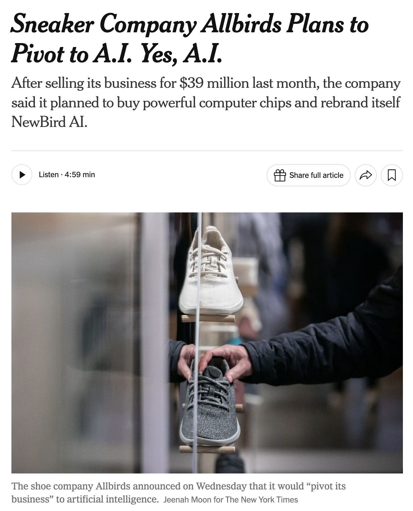
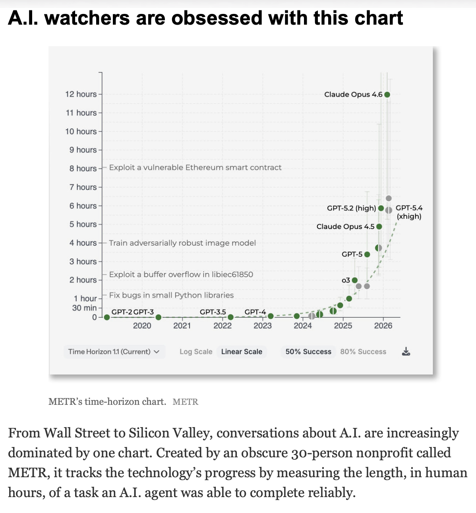

# [Week FOURTEEN]{.r-fit-text}

# News

##

## Claude Design
- Youtube is flooded with idiotic videos about how to make distracting, animation-ridden websites with Claude Design
- Debate has started as to whether Claude Design will be the end of Figma and Adobe (I'm betting not)
- It's reminiscent of many other tool introductions, such as the Macintosh, which was supposed to eliminate graphic designers, and the DEC Vax, which was supposed to eliminate programmers
- Some pundits claim Anthropic is just using Claude to build any kind of software rather than sticking to building better models
- Limitation: (claim) it doesn't identify and solve real problems by itself---it's more tool than autonomous designer

## ChatGPT Images 2.0
- Ditto

## Framework 13 Pro
- A new laptop that ameliorates the RAM shortage by letting you upgrade RAM later
- May allow waiting for local models to catch up (but maybe Qwen 3.6 already has!)
- Value proposition is upgradability in general
- Plus, no Windows Tax!
- Framework is the darling of Hacker News, by the way

## Mythos Questioned
- A new study says Mythos is uncovering fewer security vulnerabilities than advertised
- Mythos's dangers are said to be largely an advertising campaign by Anthropic
- Yet the government wants to use Mythos, regardless of DoD's proscription of Anthropic

## Musk buys Cursor
- For 60 billion dollars?!
- Gives Cursor access to hardware it lacks to compete with the big boys
- Gives Musk access to better software than xAI has been able to generate

## METR in the news

# Summary

## The Good
- New models appear with increasing frequency
- The adventure shows no signs of slowing down
- You are well armed for future use of genAI
- Those of you continuing at UT Austin will get better tools next academic year

## The Bad
- One student told me that academia is falling so far behind industry that she's solving problems that no cares about with tools no one uses
- Regulation of AI seems no closer than regulation of social media
- A *rich get richer and poor get poorer* situation seems to be happening with genAI

## The Ugly
- In the movie *The Good, The Bad, and The Ugly*, Tuco, the ugly member of the trio, winds up in a predicament that has no easy solution at the end.
- Yet we the audience are meant to hope that he lives to fight another day.
- Is that the case for us with genAI?



