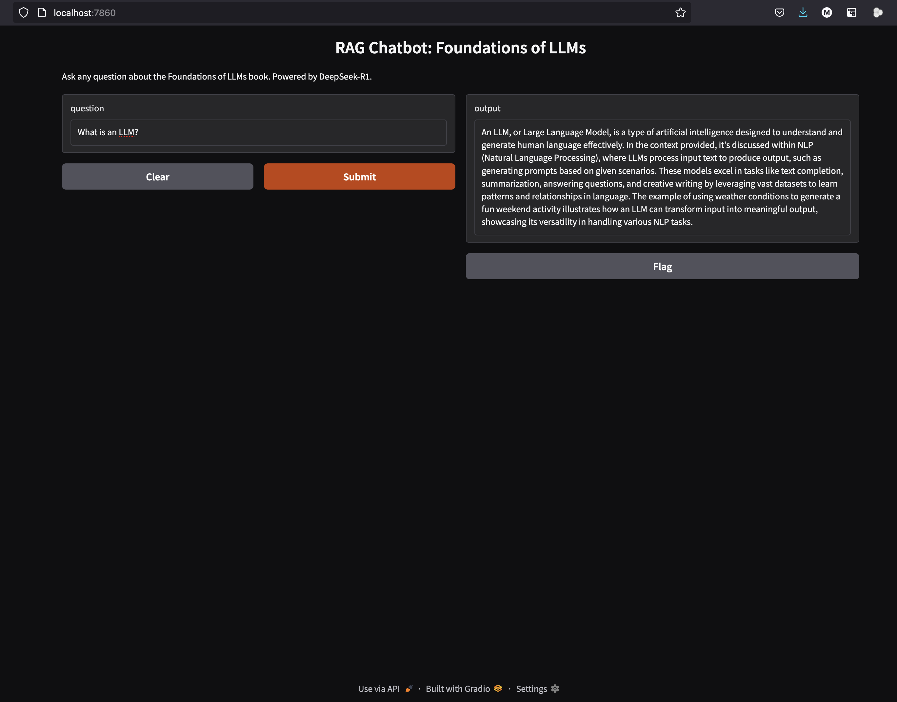

You should *not* try to render this file until you have run the code in the accompanying slides. You must have Ollama and DeepSeek-R1 installed on your machine, which is described in the lecture slides. Then you must be running Ollama via `ollama serve` in a separate terminal window.

We will follow a modification of the tutorial by
Aashi Dutt at
[https://www.datacamp.com/tutorial/deepseek-r1-rag](https://www.datacamp.com/tutorial/deepseek-r1-rag)

# Installations

You must at least install the following packages (maybe more---I have over 300 python packages installed on my machine, and may just happen to have some required packages already installed). Note that, when you render this file, the following chunk *will not* be executed. This is because the keyword `bash` at the beginning of the chunk is not in curly braces. The reason for this is that the chunk should only be run once. The other chunks need to be run every time you want to run the code. You should copy and paste this first chunk into your terminal and run it.

```bash
pip install langchain chromadb gradio ollama pymupdf langchain_ollama langchain_chroma
pip install -U langchain-community
```

Unfortunately, I experienced some problems with the packages. I ran `pip-upgrade`, which is defined as

```bash
alias pip-upgrade="pip list -o | cut -f1 -d' ' | tr ' ' '\n' | awk '{if(NR>=3)print}' | cut -d' ' -f1 | xargs -n1 pip install -U"
```

in my `.bash_profile`. Somewhere in a kadillion lines of output was an error message that I did not catch at first, saying that my version of `pydantic` was incompatible with my version of `pydantic-core`. You can check your versions by running `pip list`. You *may* need to downgrade `pydantic_core` to 2.27.2 as I did. You can do this by running `pip install pydantic-core==2.27.2` after uninstalling `pydantic-core` with `pip uninstall pydantic-core`. Why would you need to do this? I found I was getting a lot of errors in `pydantic` that I could not resolve and that were not mentioned online. That's when I looked back at the `pip-upgrade` output and found the error message.

# Package imports
You must import the following packages but be careful to just run this chunk first and watch the output. A couple of the functions are deprecated but still work. That may change and the error messages should give clues about what to do in that case.

```{python}
import ollama
from langchain_text_splitters import RecursiveCharacterTextSplitter
from langchain_community.document_loaders import PyMuPDFLoader
from langchain_community.embeddings import OllamaEmbeddings
from langchain_ollama import OllamaEmbeddings
from chromadb.config import Settings
from chromadb import Client
from langchain_chroma import Chroma
import gradio as gr
import re
from concurrent.futures import ThreadPoolExecutor
```

# The document
The whole point of this tutorial is create a chatbot that can answer questions about the book *Foundations of LLMs* by Xiao and Zhu. The following chunk loads the document. It assumes you have downloaded the document and saved it in the same directory as this file. You then split it into smaller chunks, use DeepSeek-R1 to generate embeddings, and store the embeddings in a vector store.

# Packages
You will use a number of packages to accomplish this. First is `PyMuPDFLoader`, which allows you to load a PDF document. You can read more about it at [https://pymupdf.readthedocs.io/en/latest/rag.html](https://pymupdf.readthedocs.io/en/latest/rag.html). It has many more capabilities we won't use and handles many other filetypes. We're just going to load a well-behaved PDF.

Second, we split the texts into chunks. The `RecursiveCharacterTextSplitter` is a very popular tool provided by `LangChain` for, as you might guess, splitting large amounts of text, such as our 231 page book, into small chunks. `LangChain` is a popular framework for building LLM applications. It *orchestrates* the various tools you use. You can read more about it at [https://python.langchain.com/docs/](https://python.langchain.com/docs/).

Next we generate embeddings for each chunk, using DeepSeek R1. The actual generation process is quite time-consuming on a typical laptop. You can see in the comments that it takes seven minutes on my machine and that you can tell when it's done by watching the window running `ollama serve`.

What are we going to do with these embeddings, which constitute a vector representation of the text? We will use them to create a vector database, which we will use to answer questions about the book. For this, we'll use ChromaDB, a popular vector database. You can read more about it at [https://docs.trychroma.com/](https://docs.trychroma.com/).

# The setup code

```{python}
#. Step 1: Load the document using PyMuPDFLoader
loader = PyMuPDFLoader("Xiao2025.pdf")
documents = loader.load()

#. Step 2: Split text into smaller chunks
text_splitter = RecursiveCharacterTextSplitter(chunk_size=1000, chunk_overlap=200)
chunks = text_splitter.split_documents(documents)

#. Step 3: Initialize Ollama embeddings
embedding_function = OllamaEmbeddings(model="nomic-embed-text")


#. Step 4: Parallelize embedding generation
def generate_embedding(chunk):
    return embedding_function.embed_query(chunk.page_content)

#. This next line takes about 7 minutes on my M1 Macbook Pro with 32GB RAM;
#.   you can tell when it's done by watching the window running `ollama serve`
with ThreadPoolExecutor() as executor:
    embeddings = list(executor.map(generate_embedding, chunks))

#. Step 5: Recreate the collection
client = Client(Settings())
#. client.delete_collection(
#.     name="foundations_of_llms"
#. )  # Delete any existing collection if needed
collection = client.get_or_create_collection(name="foundations_of_llms")

#. Step 6: Add documents and embeddings to Chroma
for idx, chunk in enumerate(chunks):
    collection.add(
        documents=[chunk.page_content],
        metadatas=[{"id": idx}],
        embeddings=[embeddings[idx]],
        ids=[str(idx)],  # Ensure IDs are strings
    )

print("Embeddings stored successfully!")
```

# Retrieve the context to answer the question
Next you have to initialize a retriever that will retrieve the context from the vector store.

```{python}

#. initialize retriever using chroma collection

retriever = Chroma(
    collection_name="foundations_of_llms",
    client=client,
    embedding_function=embedding_function,
).as_retriever()


def retrieve_context(question):
    results = retriever.invoke(question)
    context = "\n\n".join([doc.page_content for doc in results])
    return context

```

# Create the prompt
Next, create the prompt, send it to DeepSeek-R1 using Ollama, and obtain a response. If this doesn't work, it may mean that you are not running Ollama via `ollama serve` in a separate terminal window.

```{python}
def query_qwen(question, context):

    # Format the input as a structured prompt
    formatted_promt = f"Question: {question}\n\nContext: {context}"

    # Send the prompt to DeepSeek-R1 using Ollama
    response = ollama.chat(
        model="qwen3.5:9b", messages=[{"role": "user", "content": formatted_promt}]
    )

    # Extract and clean the response
    response_content = response["message"]["content"]
    final_answer = re.sub(
        r"<think>.*?</think>", "", response_content, flags=re.DOTALL
    ).strip()
    return final_answer
```

# Define the RAG pipeline
Next, define the RAG (retrieval augmented generation) pipeline.

```{python}
def rag_pipeline(question):

    # Retrieve context from the vector store
    context = retrieve_context(question)

    # Generate an answer using DeepSeek-R1
    answer = query_qwen(question, context)
    return answer
```

Actually run the RAG pipeline.

```{python}
def ask_question(question):
    # Run the RAG pipeline
    return rag_pipeline(question)
```

# Gradio interface
Finally, create a Gradio interface for the chatbot. This will appear as a web page in your browser. The user can enter as many prompts as they like. Gradio is a popular library for creating web interfaces for machine learning models. You can read more about it at [https://gradio.app/](https://gradio.app/).

```{python}
#. Create a Gradio interface
interface = gr.Interface(
    fn=ask_question,
    inputs="text",
    outputs="text",
    title="RAG Chatbot: Foundations of LLMs",
    description="Ask any question about the Foundations of LLMs book. Powered by Qwen 3.5.",
)
```

Note that I have commented out the following line that actually launches the Gradio interface. This is only for rendering purposes. It should be commented out when you render the document. When you want to actually run the code, you should uncomment it. The interface will then appear in your browser if you point to `http://localhost:7860`.

```{python}
#. Launch the Gradio app
#. interface.launch(debug=True)
```

Here is a screenshot of the interface, answering a simple question.

{alt-text="A simple question and answer interface"}

